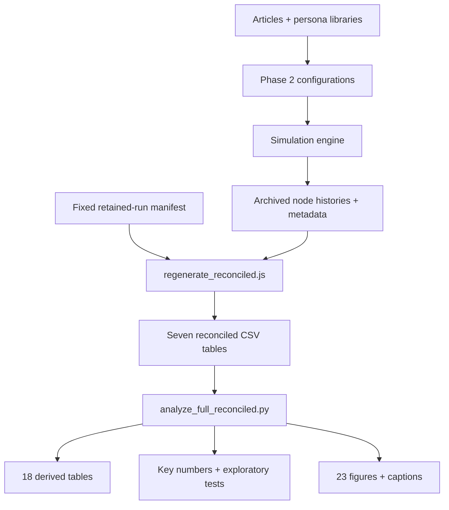
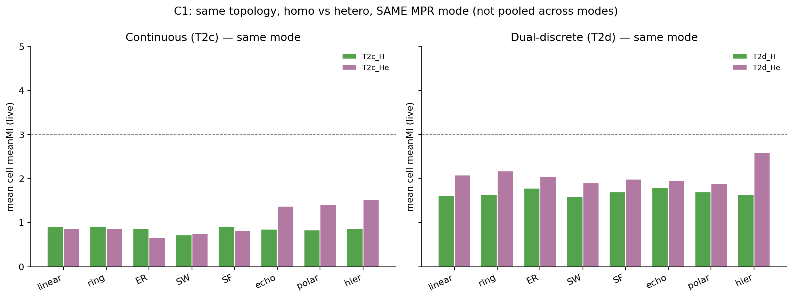
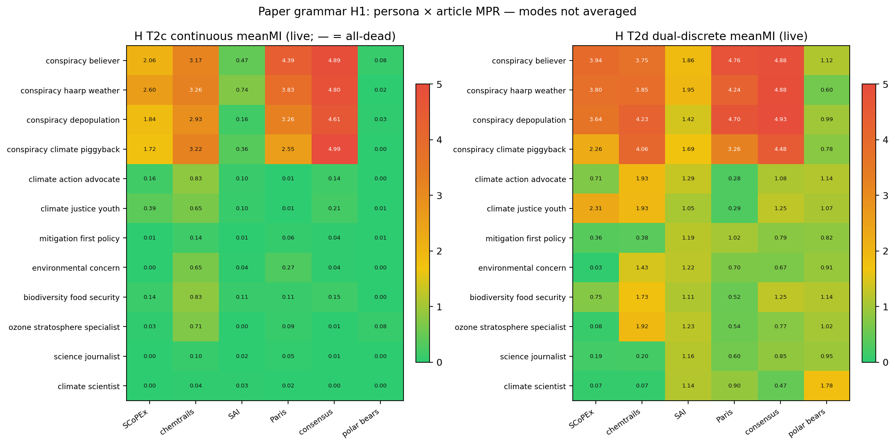

# LLM Society Simulation

Code, archived experiments, analysis, and figures for **Simulating Misinformation Propagation in Social Networks: From Linear Chains to Society-Scale Digital Twins**.

This repository studies how persona-conditioned language-model agents preserve, omit, or contradict source claims as messages travel through social-network structures. It contains a file-based JavaScript simulation engine, research configurations and recorded histories, Python and JavaScript analysis tools, numerical tables, and figures.

The main research campaign comprises **288 configurations and 1,728 configuration–article cells**, using six climate/geoengineering stimuli, eight network conditions, twelve homogeneous persona conditions, six heterogeneous mixes, and two scoring regimes. Each configuration has one retained run with an eight-tick horizon. A separate D-net stress test uses a constructed 63-node hashtag graph.

For the primary numerical results, use `results_phase2/tables_reconciled/` and `analysis_full_reconciled/` under `thesisExperiment/`. Earlier pilot and historical table sets are also available and have different scopes. The research evaluates descriptive differences in source-claim preservation; it does not establish human behavioral validity or a validated empirical digital twin.

This README is the central project reference. It covers both the executed research campaign and optional engine capabilities. Sections describing an available module should not be interpreted as evidence that the main campaign evaluated that module.

## Contents

- [Find the right starting point](#find-the-right-starting-point)
- [Installation and quick start](#installation-and-quick-start)
- [Repository layout](#repository-layout)
- [Architecture and execution](#architecture-and-execution)
- [Source-module reference](#source-module-reference)
- [Configuration reference](#configuration-reference)
- [Command-line reference](#command-line-reference)
- [Graph topologies](#graph-topologies)
- [Personas and articles](#personas-and-articles)
- [Main research experiment design](#main-research-experiment-design)
- [Measurement and scoring](#measurement-and-scoring)
- [Results from the reconciled tables](#results-from-the-reconciled-tables)
- [D-net structural stress test](#d-net-structural-stress-test)
- [Execution and scoring coverage](#execution-and-scoring-coverage)
- [Table and analysis reference](#table-and-analysis-reference)
- [Figure guide](#figure-guide)
- [Offline reproduction](#offline-reproduction)
- [Research script catalogue](#research-script-catalogue)
- [Data provenance and access](#data-provenance-and-access)
- [Runtime files and schemas](#runtime-files-and-schemas)
- [Optional engine capabilities](#optional-engine-capabilities)
- [Scenario DSL](#scenario-dsl)
- [Extending the project](#extending-the-project)
- [Troubleshooting](#troubleshooting)
- [Interpretation limits](#interpretation-limits)
- [Research lineage and reference records](#research-lineage-and-reference-records)
- [Glossary](#glossary)

## Find the right starting point

| Goal | Start with |
| --- | --- |
| Inspect the primary results | [key_numbers.json](thesisExperiment/analysis_full_reconciled/key_numbers.json) and the results section below |
| Browse primary figures | [Reconciled figures](thesisExperiment/analysis_full_reconciled/figures/) |
| Reproduce archived numbers without API calls | [Offline reproduction](#offline-reproduction) |
| Inspect an experiment | [Fixed manifest](thesisExperiment/results_phase2/retained_runs_manifest.json) → selected run → node histories |
| Try the engine | [Installation and quick start](#installation-and-quick-start) |
| Understand implementation | [Architecture and execution](#architecture-and-execution) and [Source-module reference](#source-module-reference) |
| Design a new run | [Configuration reference](#configuration-reference), [Graph topologies](#graph-topologies), and [Scenario DSL](#scenario-dsl) |
| Understand coverage and limitations | [Execution and scoring coverage](#execution-and-scoring-coverage) and [Interpretation limits](#interpretation-limits) |

## Installation and quick start

### Requirements

- Node.js 18 or later for the simulation and JavaScript analysis tools.
- Python 3.10 or later for the comparative analysis; Python 3.10 union-type syntax is used in the analysis utilities.
- NumPy, pandas, SciPy, and Matplotlib for the research analysis.
- NetworkX and seaborn, in addition to Matplotlib and NumPy, for the general engine visualiser.
- A configured model-provider credential for live model calls. Archived-data analysis and dry runs do not require credentials.

The JavaScript engine uses built-in Node modules and a local YAML-subset parser. It does not require `npm install`. There is no dependency lockfile capturing the exact historical Python environment.

Run commands from the repository root so relative input paths resolve correctly.

```bash
git clone https://github.com/RajGM/LLM_Society.git
cd LLM_Society
python -m venv .venv
```

Activate the environment in PowerShell:

```powershell
.\.venv\Scripts\Activate.ps1
```

Or in Bash:

```bash
source .venv/bin/activate
```

```bash
python -m pip install -r requirements_viz.txt
python -m pip install pandas scipy
node index.js --dry-run --config examples/run_linear_chain.json
```

The example dry run creates a timestamped directory under `experiments/`, propagates the configured articles, performs mock auditing, and prints a per-node summary. The mock discrete auditor returns all-correct answers; the mock continuous auditor returns near-perfect values. A dry run demonstrates execution and file generation, not model accuracy or a research finding.

Additional inexpensive entry points:

```bash
node index.js --test-extensions
node index.js --list-personas
node index.js --list-articles
node index.js --validate scenarios/climate_debate.yaml
node index.js --compile scenarios/climate_debate.yaml --summary
```

`--test-extensions` enables dry-run mode internally. The CLI is implemented by explicit argument checks in `index.js`; it has no `--help` handler or general unknown-option rejection. Use the command reference in this README. Running the entry point without a recognized mode falls through to simulation execution.

### Live runs and model configuration

Set `OPENAI_API_KEY` in the process environment or in the local, ignored `.env` file. The environment takes precedence over matching values in `.env`. Do not place credentials in configurations or commit them.

```text
OPENAI_API_KEY=your-provider-key
```

```bash
node index.js --config examples/run_linear_chain.json
python visualize.py --latest
```

The registered model IDs are currently `gpt-4o-mini` and `gpt-4o` in [config/models.js](config/models.js). The transport layer also has Anthropic and Ollama adapters, but those providers need explicit registry entries before use. A provider adapter's presence is not the same as a configured model.

The current OpenAI transport requests temperature `0.7` and a maximum of `700` completion tokens. These settings are implemented in `src/llmClient.js`, not exposed as arbitrary per-run temperature overrides. Rewriting uses the receiving persona's system prompt and asks for a 100–200-word rewrite.

Live calls incur provider usage costs. The engine records successful responses, token usage, and selected errors. Its dollar estimates use constants in the code and should be treated as bookkeeping estimates rather than current provider prices. Network requests have a 120-second timeout; the HTTP client contains no automatic retry/backoff loop.

### Visualise a run

```bash
python visualize.py --latest
python visualize.py experiments/exp_YYYY-MM-DD_HH-MM-SS
python visualize.py experiments/exp_YYYY-MM-DD_HH-MM-SS --out-dir reproduction_output/run_plots
```

Replace the example experiment directory with an existing run. The general visualiser reads engine output, whereas the research plotting scripts read campaign tables. `--latest` searches `experiments/`; use an explicit path for research runs under `thesisExperiment/runs_phase2/`.

## Repository layout

| Path | Contents |
|---|---|
| `index.js`, `src/` | Command-line interface, simulation, graph construction, agents, auditing, and optional research modules |
| `config/` | Default experiment parameters and model-provider registry |
| `examples/`, `scenarios/` | Example JSON configurations and YAML scenario definitions |
| `articles/`, `personas/` | Default engine stimuli and persona profiles |
| `data/` | Sample cascade data for graph-import demonstrations |
| `visualize.py`, `requirements_viz.txt` | General engine-output plotting and dependencies |
| `experiments/`, `ab_tests/` | Local runtime outputs, excluded from version control |
| `thesisExperiment/articles/` | Research stimulus library, including `merged.json` |
| `thesisExperiment/personas/` | Research personas; Phase 2 profiles and heterogeneous mixes are in `phase2/` |
| `thesisExperiment/configs/` | Pilot and Phase 2 experiment configurations |
| `thesisExperiment/scripts/` | Input builders, campaign runners, parsers, graph reconstruction, and plotting utilities |
| `thesisExperiment/runs_phase2/` | Archived Phase 2 metadata, node histories, and per-article outputs |
| `thesisExperiment/results_phase2/` | Fixed manifest, historical tables, reconciled tables, execution logs, and graph comparisons |
| `thesisExperiment/analysis_full_reconciled/` | Primary comparative analysis, 18 derived CSV tables, numeric summaries, and 23 figures |
| `thesisExperiment/analysis_full/` | Comparative analysis of historical tables and the API-error audit |
| `thesisExperiment/analysis_phase2/` | Earlier Phase 2 plots, derived tables, and `stats.json`, based on historical tables |
| `thesisExperiment/runs/`, `thesisExperiment/results/` | Pilot campaign histories, tables, and figures |
| `thesisExperiment/discovery/` | Reference extracts, candidate inputs, and exploratory plotting resources |
| `thesisExperiment/data/` | Downloaded source material, external analysis code, hashtag aggregates, and graph inputs |
| `thesisExperiment/CONSOLIDATED_OVERLAPS/` | Alternative archived outputs and scripts; use the fixed manifest for primary run selection |
| `reproduction_output/` | Isolated local regeneration outputs, excluded from version control |

### Research data flow

The links below follow the primary numerical reproduction path. Input builders and live campaign runners precede this path when producing new experiments.



The checked-in reconciled tables are the analysis script's default inputs. The isolated regeneration workflow writes a new copy for comparison; it does not silently switch the analysis script to a different dataset.

## Architecture and execution

### Responsibilities

`index.js` selects a mode, loads the configuration, and invokes a simulation or a specialized experiment runner. `Simulation` loads articles and personas, merges defaults, creates an experiment directory, constructs a graph, executes propagation, audits recorded outputs, and aggregates results. `SimulationNode` persists each agent's state in its own JSON file. `Auditor` implements the scoring instruments. `llmClient` handles model requests and dry-run responses.

The persistent files make individual messages, decisions, and scores inspectable without a database. They also mean that a metadata snapshot and all node files need not represent an atomic point in an interrupted run.

### Lifecycle of an ordinary run

1. Merge `config/experiment.js` defaults with the supplied run configuration.
2. Load the selected persona and article libraries and construct their ID lookups.
3. Create the experiment directory, write running metadata, build the graph, and save its initial topology.
4. Initialize enabled optional state such as beliefs, bot assignments, and institutional trust.
5. Seed each article at the configured seed nodes. Ordinary articles propagate separately; explicitly configured competitive groups propagate together.
6. At each tick, process active nodes' inboxes, record their decisions, and collect outgoing messages. Delivery occurs after the nodes for that tick have been processed.
7. Stop a propagation loop at `maxTicks` or when no outgoing messages remain.
8. After propagation, audit eligible forwarded/reinterpreted outputs and write their scores into the node histories.
9. Apply audit-time trust changes and enabled post-audit metrics, collect per-article results, export the human-rating template, and write completion metadata.

Propagation and auditing are separate phases. Scores computed later in the audit phase do not retroactively change the messages already propagated in that run. This timing matters when interpreting trust evolution, edge changes, and interventions.

### Message decisions

| Action | Behavior | Typical scoring eligibility |
| --- | --- | --- |
| forward | Pass the received text to outgoing neighbors | Eligible when contentOut exists |
| reinterpret | Request a persona-conditioned rewrite, then send it to outgoing neighbors | Eligible when contentOut exists |
| drop | Record the rejection; send nothing | Not audited as a forwarded/reinterpreted output |
| dump | Keep a local event without forwarding | Not audited by auditPendingEvents |

For ordinary agents, the hop limit and trust checks precede action selection. Optional provenance and institutional-trust logic can change acceptance; optional beliefs can change action weights; a configured strategy can override weighted sampling. Bot agents use a separate processing path.

Action weights are sampled cumulatively in insertion order. They are not automatically normalized. If their total is below one, the remaining probability selects `dump`. Keep intended probabilities explicit and avoid totals above one.

Each node limits queued messages per article through `maxInboxSize`. Excess messages are discarded at delivery. An `always` node processes every tick; `weekly` is active on ticks satisfying `tick % 7 == 1`; `random` has a 0.7 activity probability at each check. An inactive node holds its inbox, but the outer loop can still terminate when there are no outgoing messages.

### Error and resume behavior

If a rewrite request throws an error, the engine uses the incoming text as the outgoing text while retaining the reinterpretation action. This is an identity-rewrite fallback. If an auditor request fails, the event can remain unscored. A malformed auditor response follows a different path: the parser defaults to all-correct answers. Those behaviors affect measurement and are reported separately in the execution audit.

`Simulation.resume()` loads `state.json`, metadata, and existing node files. Completed runs return their recorded results. A partly propagated article is restarted at the article boundary; the mechanism is not an exact continuation of a suspended model request. Already scored audit events are skipped when auditing resumes.

```bash
node index.js --resume experiments/exp_YYYY-MM-DD_HH-MM-SS
```

Use resume on an experiment you intend to continue. Reproducing archived tables does not require resuming or changing the retained histories.

## Source-module reference

| Module | Responsibility |
| --- | --- |
| [Simulation.js](src/Simulation.js) | Configuration, run lifecycle, graph creation, checkpoints, propagation, auditing, and result collection. |
| [SimulationNode.js](src/SimulationNode.js) | Persistent inbox/history, activity, trust gates, decisions, rewriting, audit updates, and node counters. |
| [SocietyGraph.js](src/SocietyGraph.js) | Topology builders, node/edge operations, graph snapshots, adjacency and trust matrices, and loading existing graphs. |
| [Auditor.js](src/Auditor.js) | Discrete, continuous, and dual claim-preservation scoring; IFD formulas; MPR and legacy severity labels. |
| [llmClient.js](src/llmClient.js) | Provider adapters, request construction, dry-run mocks, usage counters, and error/timeout handling. |
| [loadEnv.js](src/loadEnv.js) | Local environment-file loading and placeholder-key detection; existing process variables take precedence. |
| [fileIO.js](src/fileIO.js) | JSON reads/writes, directory creation, existence checks, and file update helpers. |
| [DSLCompiler.js](src/DSLCompiler.js) | YAML/JSON scenario parsing, validation, seeded group expansion, references, edges, and flat run configurations. |
| [BeliefEngine.js](src/BeliefEngine.js) | Topic beliefs, emotional state, content alignment, and action-weight adjustments. |
| [FrameAuditor.js](src/FrameAuditor.js) | Optional framing, sentiment, new-claim, and coherence judgments on message outputs. |
| [InterventionEngine.js](src/InterventionEngine.js) | Scheduled fact-checker injection, inoculation, and content-moderation operations. |
| [MetricsEngine.js](src/MetricsEngine.js) | Post-run MI trajectories, reach, Gini, half-life, structural and bot metrics, IFD aggregates, and rating CSVs. |
| [ABTestRunner.js](src/ABTestRunner.js) | Repeated baseline/variant runs, metric aggregation, and Cohen's d comparisons. |
| [ProvenanceEngine.js](src/ProvenanceEngine.js) | Trust computed from a message's multi-hop provenance. |
| [NetworkEvolution.js](src/NetworkEvolution.js) | Opinion-related edge creation/severing and homophily/modularity diagnostics. |
| [StrategyEngine.js](src/StrategyEngine.js) | Heuristic action strategies for reach, distortion, alignment, or moderation objectives. |
| [OpinionDynamics.js](src/OpinionDynamics.js) | DeGroot, bounded-confidence, and voter-model projections of stored opinion values. |
| [InstitutionalTrust.js](src/InstitutionalTrust.js) | Per-node trust in media, science, government, and corporate institutions. |
| [BotEngine.js](src/BotEngine.js) | Bot detection, persona-based transformations, placement, and removal strategies without model calls. |
| [BotResilienceRunner.js](src/BotResilienceRunner.js) | Baseline, factorial bot injection, and removal experiments. |
| [PolarizationMetrics.js](src/PolarizationMetrics.js) | Composite polarization index, snapshots, and heuristic change-point detection. |
| [MultiCycleRunner.js](src/MultiCycleRunner.js) | Repeated runs with state carry-over, article sequences, parameter sweeps, and intervention timing. |
| [RealGraphImporter.js](src/RealGraphImporter.js) | Cascade import, persona inference, trust estimation, and article-question preparation. |
| [ValidationMetrics.js](src/ValidationMetrics.js) | Comparable real/simulated cascade depth, breadth, size, virality, and time-span summaries. |
| [ValidationComparison.js](src/ValidationComparison.js) | Structural comparison, approximate KS/JS comparisons, and composite DTFS calculation. |
| [ContentDriftValidation.js](src/ContentDriftValidation.js) | Simulated content-drift extraction and comparison where empirical content is available. |
| [DigitalTwinRunner.js](src/DigitalTwinRunner.js) | Single-cascade import, simulation, comparison, and report generation. |
| [BatchValidationRunner.js](src/BatchValidationRunner.js) | Multiple-cascade comparisons and distributional summaries. |
| [SensitivityRunner.js](src/SensitivityRunner.js) | Comparisons across persona-inference strategies. |

## Configuration reference

### Input hierarchy and paths

The engine defaults are in [config/experiment.js](config/experiment.js). A run configuration overrides top-level defaults. `nodeParams` and `topologyParams` are merged one level deep; nested objects such as `actionWeights` are replaced as a unit. Per-node `params` override the resolved run-level node parameters during message processing.

`personasPath`, `articlesPath`, and `outputRoot` are resolved relative to the current working directory unless absolute. Their defaults are `personas/personas.json`, `articles/articles.json`, and `experiments/`. Persona and article files must expose top-level `personas` and `articles` arrays respectively.

| Parameter | Default | Meaning |
| --- | --- | --- |
| `topology` | `"linear_chain"` | Graph builder name; custom graphs use explicit nodes and edges. |
| `topologyParams` | `{"numNodes": 5, "edgeProbability": 0.3}` | Graph size and builder-specific parameters. |
| `maxTicks` | `10` | Maximum propagation ticks per article or competitive group. |
| `defaultModel` | `"gpt-4o-mini"` | Registered model ID used when constructing ordinary nodes. |
| `auditorModel` | `"gpt-4o-mini"` | Registered model ID used for scoring. |
| `auditorQuestions` | `5` | Declared question-count setting; actual scoring uses the selected article's questions array. |
| `miScoringMode` | `"discrete"` | discrete, continuous, or dual. |
| `enableBeliefs` | `false` | Enable belief/alignment and emotional-state processing. |
| `enableFrameAnalysis` | `false` | Enable additional framing/content judgments during auditing. |
| `enableProvenance` | `false` | Enable provenance-chain trust gates. |
| `provenanceRecencyDiscount` | `0.9` | Discount factor in provenance trust. |
| `enableStrategicAgents` | `false` | Allow strategy-based action selection. |
| `enableNetworkEvolution` | `false` | Enable post-audit edge evolution. |
| `networkEvolutionParams` | `{"creationProb": 0.05, "severingThreshold": 0.25, "maxNewEdges": 3, "trustForNewEdge": 0.4}` | Creation probability, severing threshold, edge cap, and new-edge trust. |
| `enableOpinionDynamics` | `false` | Compute opinion-model projections from belief state. |
| `opinionDynamicsParams` | `{"steps": 50, "epsilon": 0.3, "voterRuns": 10}` | Projection steps, bounded-confidence threshold, and voter repetitions. |
| `enableInstitutionalTrust` | `false` | Enable institutional-trust state and acceptance multiplier. |
| `institutionalTrustParams` | `{"erosionRate": 0.03, "recoveryRate": 0.01}` | Institutional erosion and recovery rates. |
| `competitiveGroups` | `[]` | Articles that share a propagation loop and optional seed nodes. |
| `interventions` | `[]` | Scheduled operations with type, tick, articleId, targetNodes, and params. |
| `nodeParams` | `{"trustThreshold": 0.2, "actionWeights": {"forward": 0.3, "reinterpret": 0.5, "drop": 0.2}, "relationEvolution": true, "trustDelta": 0.05, "maxHops": 8, "strippedProperties": [], "activityPattern": "always", "edgeDeletionThreshold": 0.05, "maxInboxSize": 20}` | Run-level decision parameters; detailed below. |
| `seedArticles` | `["crime_0"]` | Article IDs to propagate. |
| `seedNodes` | `["node_0"]` | Node IDs that receive the initial article. |

### Node decision parameters

| Parameter | Default | Meaning |
| --- | --- | --- |
| `trustThreshold` | `0.2` | Reject messages below this effective source trust. |
| `actionWeights` | `{"forward": 0.3, "reinterpret": 0.5, "drop": 0.2}` | Cumulative probabilities for forward, reinterpret, and drop; remaining mass becomes dump. |
| `relationEvolution` | `true` | Retained configuration field; audit-time trust changes are controlled by the trustDelta passed to auditPendingEvents. Setting this field alone should not be assumed to disable updates. |
| `trustDelta` | `0.05` | Audit-time trust increment; subtracted for MI above three and added otherwise. |
| `maxHops` | `8` | Drop ordinary messages whose incoming hop count reaches this value. |
| `strippedProperties` | `[]` | Persona properties whose textual values are masked in the rewrite prompt. |
| `activityPattern` | `"always"` | always, weekly, or random. |
| `edgeDeletionThreshold` | `0.05` | Audit-time trust threshold for removing a source relation; zero disables this deletion check. |
| `maxInboxSize` | `20` | Maximum queued messages per article per node. |

Trust values are clipped into [0,1] during audit updates. The code changes a relation only when the recorded source is present in the receiving node's relation map. Directed graph edges, source trust lookups, and outgoing-neighbor maps should therefore be inspected together when diagnosing a custom network.

Additional run fields include `experimentName`, `graphRandomSeed`, `defaultPersonaAssignment`, explicit `nodes`/`edges`, and `botInjection`. `defaultPersonaAssignment` supports sequential, random, and cluster-based selection. Unknown persona IDs can fall back to a neutral or first available persona; use exact IDs to avoid an unintended assignment.

### Minimal ordinary configuration

```json
{
  "topology": "linear_chain",
  "topologyParams": {
    "numNodes": 5
  },
  "maxTicks": 8,
  "defaultModel": "gpt-4o-mini",
  "auditorModel": "gpt-4o-mini",
  "auditorQuestions": 5,
  "seedArticles": [
    "crime_0",
    "technology_0"
  ],
  "seedNodes": [
    "node_0"
  ],
  "defaultPersonaAssignment": "sequential",
  "nodeParams": {
    "trustThreshold": 0.2,
    "actionWeights": {
      "forward": 0.25,
      "reinterpret": 0.55,
      "drop": 0.15
    },
    "relationEvolution": true,
    "trustDelta": 0.05,
    "maxHops": 6,
    "strippedProperties": []
  }
}
```

### Explicit custom graph

A custom graph selects the persona and model for every node and specifies directed edges with trust values. The following small configuration uses existing default persona and article IDs.

```json
{
  "topology": "custom",
  "maxTicks": 4,
  "auditorModel": "gpt-4o-mini",
  "seedArticles": [
    "crime_0"
  ],
  "seedNodes": [
    "source"
  ],
  "nodes": [
    {
      "nodeId": "source",
      "personaId": "neutral",
      "modelId": "gpt-4o-mini"
    },
    {
      "nodeId": "reader",
      "personaId": "investigative_journalist",
      "modelId": "gpt-4o-mini"
    }
  ],
  "edges": [
    {
      "from": "source",
      "to": "reader",
      "trust": 0.7
    }
  ],
  "nodeParams": {
    "actionWeights": {
      "forward": 0.5,
      "reinterpret": 0.4,
      "drop": 0.1
    },
    "maxHops": 4
  }
}
```

For a new experiment, use a separate output root. Editing a copied research configuration's `outputRoot` to `experiments/research_trials` keeps new model calls separate from retained histories. A model call rerun is a new observation, not a reconstruction of the archived response.

## Command-line reference

Choose one primary execution mode per invocation. The parser handles modes in source-code order rather than composing several runners. Comma-separated lists must be supplied as one argument. `--dry-run` applies to the downstream model client; it still writes local experiment outputs.

| Option | Mode | Purpose |
| --- | --- | --- |
| `--config <file>` | Ordinary run or a runner accepting a base configuration | Read a JSON run configuration. |
| `--dry-run` | Model-using modes | Intercept model requests with local mock responses. |
| `--test-extensions` | Standalone | Run the bundled extension smoke check with mocked model calls. |
| `--list-personas` | Standalone | List the default persona library. |
| `--list-articles` | Standalone | List the default article library. |
| `--resume <directory>` | Standalone | Resume the experiment represented by its state and metadata files. |
| `--validate <scenario>` | Scenario | Validate the YAML/JSON scenario without running a simulation. |
| `--compile <scenario>` | Scenario | Compile a scenario into a flat JSON run configuration. |
| `--out <file>` | Compile | Write compiled JSON to a file whose parent directory exists. |
| `--summary` | Compile | Print a compilation summary in addition to the compiled output. |
| `--scenario <file>` | Scenario | Compile and execute the scenario. |
| `--ab-test` | A/B comparison | Run a baseline and one or more variants. |
| `--base <file>` | A/B comparison | Baseline JSON configuration. |
| `--variant <file>` | A/B comparison | Variant configuration; repeat the flag for several variants. |
| `--runs <integer>` | A/B comparison or digital twin | Repetitions for the selected runner. |
| `--bot-resilience` | Bot experiment | Run baseline, injection, and removal phases. |
| `--bot-densities <list>` | Bot experiment | Comma-separated density values. |
| `--bot-types <list>` | Bot experiment | amplifier, distorter, agenda, or flooder. |
| `--bot-placements <list>` | Bot experiment | Placement strategy names supported by BotEngine. |
| `--bot-removals <list>` | Bot experiment | Removal strategy names supported by BotEngine. |
| `--article <id>` | Bot experiment | Single article used by the resilience runner. |
| `--polarization` | Multi-cycle experiment | Run repeated cycles and record polarization snapshots. |
| `--cycles <integer>` | Polarization modes | Number of cycles. |
| `--sequence <name>` | Polarization | Article sequencing strategy. |
| `--articles <list>` | Polarization | Comma-separated article IDs. |
| `--polarization-phase-diagram` | Parameter sweep | Sweep ideology and expert proportions. |
| `--ideology-range <list>` | Parameter sweep | Ideology proportions; defaults are 0.1,0.3,0.5,0.7. |
| `--expert-range <list>` | Parameter sweep | Expert proportions; defaults are 0.0,0.1,0.2,0.3. |
| `--polarization-intervention` | Timing experiment | Run intervention-cycle comparisons. |
| `--intervention-cycles <list>` | Timing experiment | Candidate intervention cycles. |
| `--digital-twin` | Cascade comparison | Import and simulate a single cascade. |
| `--cascade <file>` | Digital twin or sensitivity | Cascade JSON input. |
| `--article-text <text>` | Digital twin or sensitivity | Supply the article as a quoted argument. |
| `--article-file <file>` | Digital twin or sensitivity | Read the article text from a file. |
| `--domain <name>` | Digital twin | Article-domain label. |
| `--inference <name>` | Digital twin or batch | Persona-inference strategy. |
| `--validate-batch` | Batch cascade comparison | Compare several cascades. |
| `--cascade-dir <directory>` | Batch cascade comparison | Directory containing cascade JSON files. |
| `--article-dir <directory>` | Batch cascade comparison | Directory containing associated article text. |
| `--max-cascades <integer>` | Batch cascade comparison | Limit cascade count. |
| `--validate-sensitivity` | Persona sensitivity | Compare inference strategies on one cascade. |
| `--strategies <list>` | Persona sensitivity | Comma-separated inference strategies. |
| `--runs-per-strategy <integer>` | Persona sensitivity | Repetitions per inference strategy. |

### Example configurations

Each example is a starting point for engine exploration. Their graph sizes, domains, enabled modules, and output locations differ from the main research campaign.

| File | Topology | Ticks | Seed articles |
| --- | --- | --- | --- |
| [run_bot_resilience.json](examples/run_bot_resilience.json) | echo_chamber | 8 | politics_0, technology_0 |
| [run_custom_graph.json](examples/run_custom_graph.json) | custom | 6 | politics_0 |
| [run_digital_twin.json](examples/run_digital_twin.json) | default | 12 |  |
| [run_echo_chamber.json](examples/run_echo_chamber.json) | echo_chamber | 15 | politics_0, healthcare_0 |
| [run_hierarchical.json](examples/run_hierarchical.json) | hierarchical | 10 | healthcare_0, crime_0 |
| [run_linear_chain.json](examples/run_linear_chain.json) | linear_chain | 8 | crime_0, technology_0 |
| [run_polarization.json](examples/run_polarization.json) | random_er | 6 | politics_0, technology_0, crime_0 |
| [run_polarized.json](examples/run_polarized.json) | polarized | 15 | politics_0 |
| [run_scale_free.json](examples/run_scale_free.json) | scale_free | 15 | technology_0, politics_0 |
| [run_small_world.json](examples/run_small_world.json) | small_world | 12 | crime_0, healthcare_0 |

### Baseline and variant comparison

```bash
node index.js --dry-run --ab-test --base examples/run_linear_chain.json --variant examples/run_echo_chamber.json --variant examples/run_polarized.json --runs 3
```

The runner creates repeated simulations, aggregates comparable metrics, and reports Cohen's d. The number of repetitions supplied to this command applies to the new comparison; it does not add replication to the archived campaign. Inspect each variant's other settings before attributing a difference to a single factor.

## Graph topologies

Nine topology names are implemented: the eight main-grid network conditions and an explicit custom graph. Graph construction is in `SocietyGraph.js` and dispatch/assignment is in `Simulation.js`.

| Topology | Structure | Important parameters |
| --- | --- | --- |
| linear_chain | Directed sequence of nodes | numNodes |
| ring | Directed chain closed into a cycle | numNodes |
| random_er | Random directed edges between node pairs | numNodes, edgeProbability |
| small_world | Local ring-neighborhood connections with rewiring | numNodes, k, beta |
| scale_free | Preferential-attachment construction | numNodes, m |
| echo_chamber | Multiple chambers with different within/between connection and trust settings | numNodes, numChambers, intraEdgeProb, interEdgeProb, intraTrust, interTrust |
| polarized | Two blocs with optional bridge nodes | numNodes, intraEdgeProb, interEdgeProb, intraTrust, interTrust, bridgeNodeIds |
| hierarchical | Branching hierarchy with downward and upward trust | numNodes, branchingFactor, downTrust, upTrust |
| custom | User-supplied directed node and edge lists | nodes, edges |

The general builders support persona-related trust adjustments. Echo-chamber and polarized builders accept a seeded random function and seed-node connectivity options. Other builders still use unseeded `Math.random()` in parts of their implementation. The presence of `graphRandomSeed` in a configuration does not make the entire simulation deterministic; action sampling, some graph construction, persona assignment modes, and hosted-model responses have separate randomness.

Inspect `graph_topology.json` and node `relations` for the actual archived network. Configuration labels identify a condition, while those files reveal the realized graph and assignment.

## Personas and articles

### Default engine persona library

A persona has an ID, name, and system prompt, with optional attributes such as tags, strategy, or bot settings. These profiles condition rewriting and optional behavioral rules. They are simulation inputs, not fitted models of individual people.

| ID | Name | Tags / role |
| --- | --- | --- |
| `politically_biased_left` | Politically Biased Individual (Left-Wing) | ideology, political |
| `politically_biased_right` | Politically Biased Individual (Right-Wing) | ideology, political |
| `lifestyle_influencer` | Social Media Influencer (Lifestyle Influencer) | social-media, identity |
| `brand_collaborator` | Social Media Influencer (Brand Collaborator) | social-media, marketing |
| `sensationalist_news` | News Agency (Sensationalist) | media, sensationalism |
| `neutral_news` | News Agency (Politically Neutral) | media, neutral |
| `medical_expert` | Domain Expertise Specialist (Medical Expert) | expert, healthcare |
| `tech_expert` | Domain Expertise Specialist (Technology Expert) | expert, technology |
| `conflict_creator` | Intentional Agent (Conflict Creator) | intentional, adversarial |
| `peacekeeper` | Intentional Agent (Peacekeeper) | intentional, prosocial |
| `simplifier` | Content Creator with Simple Tone (Simplifier) | communication, accessibility |
| `rural_educator` | Rural Educator (Primary Educator) | education, community |
| `young_parent` | Parent (Young Parent) | identity, family |
| `low_education` | Contextually Unaware Agent (Low Education Level) | cognitive, education |
| `lgbtq_advocate` | Gender Equality Advocate (LGBTQ+ Advocate) | advocacy, identity |
| `investigative_journalist` | Journalist (Investigative Journalist) | media, expert |
| `opinion_columnist` | Journalist (Opinion Columnist) | media, opinion |
| `religious_leader` | Religious Leader (Conservative Religious Leader) | ideology, religion |
| `gadget_enthusiast` | Tech-Savvy Consumer (Gadget Enthusiast) | consumer, technology |
| `environmentalist` | Environmentalist (Sustainable Living Advocate) | advocacy, environment |
| `startup_founder` | Entrepreneur (Tech Startup Founder) | entrepreneurship, technology |
| `neutral` | Neutral Agent (No Persona) | neutral, baseline |
| `bot_amplifier` | Bot — Amplifier | bot, amplifier; bot |
| `bot_distorter` | Bot — Distorter | bot, distorter; bot |
| `bot_agenda` | Bot — Agenda Pusher | bot, agenda; bot |
| `bot_flooder` | Bot — Flooder | bot, flooder; bot |

The research campaign uses separate libraries under `thesisExperiment/personas/`. Homogeneous runs load a single profile; heterogeneous runs load a selected profile pool. Default engine persona IDs should not be substituted for research personas when regenerating the campaign design.

### Default article library

| ID | Title | Questions |
| --- | --- | --- |
| `crime_0` | FBI 2023 Crime Report | 5 |
| `education_0` | AI in College Debate | 5 |
| `technology_0` | IBM AI Debater | 5 |
| `politics_0` | AI Policy: Trump vs Harris | 5 |
| `healthcare_0` | Cancer Facts 2024 | 5 |

An article record contains `id`, `text`, `questions`, and `groundTruth`, with descriptive/source fields where available. The boolean ground-truth array provides the expected yes/no answer for each keyed question. The auditor evaluates the message text against these claims; it does not independently fact-check all statements in the article.

### Main-campaign stimuli and scoring questions

The six article IDs below are selected by the main Phase 2 configurations from `thesisExperiment/articles/merged.json`. The merged library can contain additional records used elsewhere.

#### scopex_2017

Harvard SCoPEx: a small stratospheric measurement experiment, not a geoengineering deployment

| Question | Expected answer |
| --- | --- |
| Was SCoPEx designed as a small scientific measurement experiment rather than a deployment of solar geoengineering to cool the planet? | Yes |
| Did the proposed science flight plan to inject thousands of tonnes of material into the stratosphere? | No |
| Was the proposed release typically calcium carbonate in amounts under 2 kilograms? | Yes |
| Did the 2021 Sweden platform test plan include releasing aerosols? | No |
| By 2024, had Harvard's principal investigator stopped pursuing SCoPEx? | Yes |

#### chemtrails_gates_2018_2021

Chemtrails, SCoPEx, and Bill Gates: what the public scientific record shows

| Question | Expected answer |
| --- | --- |
| Does the scientific community treat chemtrails as a verified secret spraying program? | No |
| Are persistent aircraft trails explained as ordinary ice-crystal contrails under certain atmospheric conditions? | Yes |
| Did Debnath and colleagues analyze hundreds of thousands of #geoengineering tweets and find chemtrails conspiracy language dominant? | Yes |
| Did public #geoengineering Twitter activity surge around the SCoPEx project around April 2017? | Yes |
| Does Bill Gates funding climate or geoengineering research constitute evidence that aircraft are spraying chemicals for population control? | No |

#### sai_geoengineering

Stratospheric aerosol injection is a proposed solar-geoengineering method, not a deployed cooling program

| Question | Expected answer |
| --- | --- |
| Is stratospheric aerosol injection a proposed research and assessment topic rather than an operational global cooling program already running via commercial jets? | Yes |
| Would SAI remove carbon dioxide from the atmosphere and stop ocean acidification? | No |
| Did large volcanic eruptions such as Pinatubo 1991 produce temporary cooling via stratospheric aerosols, which SAI would try to mimic? | Yes |
| Does the IPCC treat SAI as having no side effects if deployed? | No |
| Is a small scientific plume experiment the same thing as planetary-scale SAI deployment? | No |

#### paris_agreement

The Paris Agreement is a 2015 UN climate treaty aiming to limit warming well below 2°C

| Question | Expected answer |
| --- | --- |
| Was the Paris Agreement adopted in 2015 with a goal of holding warming well below 2°C and pursuing 1.5°C? | Yes |
| Does the Agreement assign each country a single fixed tonnage quota with no NDC updates? | No |
| Are nationally determined contributions the main vehicle for Parties' mitigation pledges? | Yes |
| Does the Paris Agreement secretly authorise a global chemtrail spraying programme? | No |
| Would meeting the temperature goals require deep cuts in greenhouse gas emissions rather than aviation spraying? | Yes |

#### climate_consensus

Multiple independent lines of evidence support a scientific consensus that humans are the dominant cause of recent warming

| Question | Expected answer |
| --- | --- |
| Do IPCC assessments and literature surveys find that humans are the dominant cause of recent global warming? | Yes |
| Is the greenhouse effect of carbon dioxide established physics? | Yes |
| Does a petition or 'European Climate Declaration' by mixed professionals overturn the assessed climate literature? | No |
| Is remaining uncertainty about climate sensitivity the same as uncertainty about whether CO2 causes warming? | No |
| Have surveys of climate papers taking a position often found around 97% endorsement of anthropogenic warming? | Yes |

#### polar_bears

Sea-ice loss threatens polar-bear hunting habitat even where some subpopulations are stable for now

| Question | Expected answer |
| --- | --- |
| Do polar bears rely on sea ice to hunt seals? | Yes |
| Has Arctic sea ice declined over the satellite record as the Arctic warmed? | Yes |
| Does a stable or increasing count in some subpopulations prove that sea-ice loss is not a threat? | No |
| Is habitat loss from declining sea ice considered a primary long-term threat by specialist assessments? | Yes |
| Would an increase in one subpopulation show that anthropogenic warming is a hoax? | No |

Full stimulus texts remain in the input library. Comparing outputs against their keyed questions is essential: omitting an article detail can raise MI even if the remaining text contains no explicit false statement.

## Main research experiment design

### Unit of analysis and campaign grid

A configuration specifies a network condition, persona condition, scoring regime, and execution settings. One retained run executes six articles under that configuration. A cell is one configuration–article combination. A scored event is one eligible node output evaluated by the auditor. Events, cells, and runs are different analysis units.

| Slice | Persona conditions | Network conditions | Configurations | Article cells |
| --- | --- | --- | --- | --- |
| T2c_H — continuous, homogeneous | 12 | 8 | 96 | 576 |
| T2d_H — dual, homogeneous | 12 | 8 | 96 | 576 |
| T2c_He — continuous, heterogeneous | 6 | 8 | 48 | 288 |
| T2d_He — dual, heterogeneous | 6 | 8 | 48 | 288 |
| Main grid total | 18 | 8 | 288 | 1728 |

The main grid uses eight nodes, an eight-tick limit, six articles, and one retained run per configuration. Generation and auditing use `gpt-4o-mini`. Configurations record `graphRandomSeed: 42`; this is a graph setting rather than a complete end-to-end random seed.

The `T2c` campaign uses a continuous headline score. The `T2d` campaign uses dual auditing, with a discrete headline and a continuous sidecar on the same event. The two campaigns are distinct executions. Pairing matching configurations across them does not mean they generated identical messages.

### Network settings actually supplied by the campaign

The following rows come from the homogeneous climate-scientist configuration for each topology. The selected persona and scoring regime vary across the grid. Cluster-specific persona pools are applied separately in heterogeneous configurations.

| Condition | Topology parameters | Trust threshold | Forward / reinterpret / drop | Assignment |
| --- | --- | --- | --- | --- |
| `linear_chain` | `{"numNodes":8}` | 0.08 | 0.1/0.85/0.05 | sequential |
| `ring` | `{"numNodes":8}` | 0.08 | 0.1/0.85/0.05 | sequential |
| `random_er` | `{"numNodes":8,"edgeProbability":0.42,"minSeedOutDegree":2}` | 0.15 | 0.35/0.5/0.15 | sequential |
| `small_world` | `{"numNodes":8,"k":4,"beta":0.1}` | 0.15 | 0.35/0.5/0.15 | sequential |
| `scale_free` | `{"numNodes":8,"m":2}` | 0.15 | 0.35/0.5/0.15 | sequential |
| `echo_chamber` | `{"numNodes":8,"numChambers":2,"intraEdgeProb":0.75,"interEdgeProb":0.08,"intraTrust":0.85,"interTrust":0.15,"minSeedOutDegree":2}` | 0.15 | 0.35/0.5/0.15 | sequential |
| `polarized` | `{"numNodes":8,"intraEdgeProb":0.75,"interEdgeProb":0.05,"intraTrust":0.88,"interTrust":0.1,"minSeedOutDegree":2}` | 0.15 | 0.35/0.5/0.15 | sequential |
| `hierarchical` | `{"numNodes":8,"branchingFactor":3,"downTrust":0.85,"upTrust":0.3}` | 0.15 | 0.35/0.5/0.15 | sequential |

All these configurations set `maxHops: 8`, `maxInboxSize: 4`, `activityPattern: "always"`, and `trustDelta: 0.05`. The topology conditions also differ in action probabilities, trust thresholds, and sometimes assignment procedures. They are bundled network conditions; a topology-only causal effect is not identified by their comparison.

### Homogeneous persona conditions

| Persona ID | Analysis family |
| --- | --- |
| `conspiracy_believer` | conspiracy |
| `conspiracy_haarp_weather` | conspiracy |
| `conspiracy_depopulation` | conspiracy |
| `conspiracy_climate_piggyback` | conspiracy |
| `climate_action_advocate` | climate_action |
| `climate_justice_youth` | climate_action |
| `mitigation_first_policy` | climate_action |
| `environmental_concern` | science_env |
| `biodiversity_food_security` | science_env |
| `ozone_stratosphere_specialist` | science_env |
| `science_journalist` | science_env |
| `climate_scientist` | science_env |

Every homogeneous configuration loads one of these profiles, repeated across its nodes. The analysis groups them into conspiracy, climate-action, and science/environment families. Family labels describe prompt composition rather than measured psychological categories.

### Heterogeneous profile pools

The exact profiles available to each mix are listed below. These are input pools. Cluster-based selection can repeat profiles or omit some pool members in the realized eight-node graph; read node `personaId` values to establish actual occupancy for a particular run.

#### mix_00

`conspiracy_believer`, `conspiracy_haarp_weather`, `conspiracy_depopulation`, `conspiracy_climate_piggyback`, `climate_action_advocate`, `climate_justice_youth`, `mitigation_first_policy`, `environmental_concern`.

#### mix_01

`conspiracy_depopulation`, `conspiracy_climate_piggyback`, `climate_action_advocate`, `climate_justice_youth`, `mitigation_first_policy`, `environmental_concern`, `ozone_stratosphere_specialist`, `biodiversity_food_security`.

#### mix_02

`climate_action_advocate`, `climate_justice_youth`, `mitigation_first_policy`, `environmental_concern`, `ozone_stratosphere_specialist`, `biodiversity_food_security`, `climate_scientist`, `science_journalist`.

#### mix_03

`mitigation_first_policy`, `platform_moderator_toxicity`, `ozone_stratosphere_specialist`, `climate_action_sweden_scopex`, `biodiversity_food_security`, `climate_scientist`, `conspiracy_believer`, `climate_justice_youth`.

#### mix_04

`climate_action_advocate`, `conspiracy_peripheral_skywatcher`, `science_journalist`, `biodiversity_food_security`, `climate_action_sweden_scopex`, `platform_moderator_toxicity`, `ozone_stratosphere_specialist`, `conspiracy_depopulation`.

#### mix_05

`climate_scientist`, `climate_action_advocate`, `conspiracy_climate_piggyback`, `biodiversity_food_security`, `platform_moderator_toxicity`, `science_journalist`, `ozone_stratosphere_specialist`, `conspiracy_peripheral_skywatcher`.

`mix_00` and `mix_01` have more conspiracy-oriented profiles than `mix_02`, whose input pool contains science, environmental, and climate-action profiles. The other mixes introduce different specialist, moderation, and conspiracy-adjacent combinations. Heterogeneity is therefore not a single scalar treatment: composition and placement both matter.

### Naming and archive selection

```text
T2d_He_polarized_mix_00
│   │  │         └── persona pool
│   │  └──────────── network condition
│   └─────────────── heterogeneous arm
└────────────────── dual auditing regime
```

Run directories append a UTC timestamp to the experiment name. Several directories can exist for the same experiment name because of interrupted or repeated execution. The fixed [retained-run manifest](thesisExperiment/results_phase2/retained_runs_manifest.json) selects the archive used by the numerical analysis. Its 297 entries include auxiliary records beyond the 288 main configurations.

### Pilot and auxiliary campaigns

`thesisExperiment/runs/` and `results/` contain the earlier campaign. Its summary records 316 article rows: 144 H, 144 He, 24 A, 3 B, and 1 D. These labels belong to that campaign's configuration scheme. Its article sets, horizons, and scoring setup should not be silently mixed with Phase 2.

The full Phase 2 table contains 1,741 rows: 1,728 main-grid rows, eight D-net rows, and five other auxiliary rows. The main-grid tables and analysis filters keep those scopes separate.

### Conceptual motivation

The campaign operationalizes selected aspects of source valence, identity alignment, clustering, repeated exposure, and a bounded propagation horizon. Configuration `pfeffer` fields record these choices. Article content and persona/network conditions vary; the initial seeding protocol and eight-tick horizon are held.

This operationalization is motivated by firestorm research, but it is not an empirical implementation of every mechanism in that literature. Cross-media dynamics has no corresponding tested component here. The eight-tick horizon is a computational design choice, not an observed firestorm duration or a protocol inferred from the Debnath dataset.

## Measurement and scoring

### Discrete auditor

For each of an article's `m` keyed claims, the discrete auditor returns:

- `+1`: the message correctly states the expected answer.
- `0`: the message lacks enough information to answer.
- `-1`: the message contradicts or distorts the expected answer.

Let `C`, `M`, and `I` be the counts of correct, missing, and incorrect answers, so `m = C + M + I`. The implemented quantities are:

```text
CR = C / m
MR = M / m
IR = I / m
MI_discrete = M + I = m × (1 - CR)
CMS_discrete = IR / (CR + 1e-9)
IE_discrete = -(CR log2 CR + MR log2 MR + IR log2 IR)
```

Zero-probability entropy terms contribute zero. In the six-article campaign, `m = 5`, so discrete MI ranges from zero to five. Missing and contradictory claims both add one point. Consequently, a shortened faithful message can have positive MI because it omits keyed details.

### Continuous auditor

The continuous auditor returns one accuracy value in [0,1] per question. Its prompt specifies 1 for fully correct, 0.5 for missing/neutral, and 0 for contradictory. Intermediate values encode partial accuracy. The implementation clamps parsed values into [0,1].

```text
CR_continuous = mean(question_scores)
MI_continuous = m × (1 - CR_continuous)
MR_continuous = fraction with 0.33 < score < 0.67
IR_continuous = fraction with score <= 0.33
CMS_continuous = (1 - CR_continuous) / (CR_continuous + 1e-9)
IE_continuous = -(CR log2 CR + (1 - CR) log2 (1 - CR))
```

Here `CR` is mean accuracy, while `MR` and `IR` are thresholded fractions. They do not generally sum to one together. A simplex interpretation appropriate to discrete `CR/MR/IR` should not be transferred mechanically to continuous outputs.

For five wholly omitted claims, the intended discrete score is 5 and the intended continuous score is 2.5. This built-in difference in omission treatment is one reason the regimes must remain separate.

### Dual scoring, gap, and agreement

The dual auditor requests discrete and continuous judgments in parallel for the same output. The top-level `misinfoIndex` and `ifd` headline remain discrete. Full instrument outputs are stored in `ifd.dual.discrete` and `ifd.dual.continuous`.

```text
event.ifd.dual.gap = abs(MI_discrete - MI_continuous)
agreement = Pearson correlation(normalized_discrete_scores, continuous_scores)
normalized_discrete_score = (discrete_score + 1) / 2
```

`meanDualGap` in the Phase 2 parser averages the stored **absolute** event gaps. Some historical chart labels abbreviate this as a score difference; the code's absolute-value definition governs its interpretation. The event gap does not show which instrument scored higher. A signed difference must be computed explicitly from the two same-event scores.

Agreement is null for a constant score vector or otherwise zero correlation denominator. A missing agreement value is not the same as zero agreement. The continuous sidecar in T2d scores messages from the dual campaign; the T2c headline comes from a separate run.

### Event, node, cell, and pooled averages

`meanMI` is the mean of all scored event headline values in a cell. `meanNodeMPR` first averages each scored node's events, then averages those node means. Nodes with more scored events receive more weight in `meanMI` but equal node weight in `meanNodeMPR`. The quantities can differ even when based on the same history.

Comparative tables then average live-cell `meanMI` values. Such a cell-pooled average is not a grand mean over every event in the campaign. The analysis also reports topology-equal averaging, in which each topology's cell mean receives equal weight. Neither pooling operation constructs a new connected network.

The engine's inherited term MPR means an average score, not a probability or a per-unit-time rate. The analysis CSVs sometimes use column names such as `continuous_MPR` and `discrete_MPR` for means of cell `meanMI`. Read each table's aggregation level.

### Legacy severity labels

| Node MPR interval | Engine label |
| --- | --- |
| MPR ≤ 1 | factual_error |
| 1 < MPR ≤ 3 | lie |
| MPR > 3 | propaganda |

These are hard-coded reporting bins. They are not validated diagnoses of intent, belief, or a human author's truthfulness.

### Within-window threshold statistic: k*

The parser groups scored events by tick, computes their mean score, and finds the earliest scored tick above three for which every later scored tick is also above three. T2c uses the continuous series; T2d has discrete and sidecar-continuous series.

Only ticks with available scores enter this calculation. A missing value means that no qualifying terminal sequence was observed; it is not a zero-tick onset. The eight-tick horizon limits the observation window. A terminal exceedance is not evidence that distortion would persist indefinitely. `kStarCensoredDiscrete` flags a detected discrete onset at the final recorded event tick according to the parser's implementation.

### Coverage and dead cells

The parser marks a cell dead when `nScored <= 1`. It retains the row, records a hatch status, and excludes it from live-cell averages. Dead cells are not replaced by zeros. A low-scoring live cell, an unscored event, a dead cell, a missing configuration, and an incomplete archived history are distinct cases.

The main grid has 292 dead cells and 1,436 live cells. Coverage changes the composition of a live-only mean and must accompany comparisons.

| Slice | Total cells | Live | Dead | Dead share | k* among live |
| --- | --- | --- | --- | --- | --- |
| T2c_H | 576 | 480 | 96 | 16.7% | 14.2% |
| T2c_He | 288 | 238 | 50 | 17.4% | 7.6% |
| T2d_H | 576 | 478 | 98 | 17.0% | 20.1% |
| T2d_He | 288 | 240 | 48 | 16.7% | 32.1% |

## Results from the reconciled tables

The values in this section come from `thesisExperiment/analysis_full_reconciled/`. Means are reported to four decimals, with live-cell filtering and instrument separation. The source files retain additional precision. These are descriptions of the retained executions, not population estimates with independent simulation replication.

### Overall scores

| Regime | Arm | Live cells | Mean cell MI | Mean node-MPR across cells |
| --- | --- | --- | --- | --- |
| Continuous | H | 480 | 0.8643 | 0.8630 |
| Continuous | He | 238 | 1.0192 | 1.0140 |
| Dual discrete | H | 478 | 1.6810 | 1.6835 |
| Dual discrete | He | 240 | 2.0800 | 2.0737 |

The heterogeneous pooled mean exceeds the homogeneous mean by **0.1549** in the continuous regime and **0.3990** in the dual-discrete regime. That pattern does not support a general claim that heterogeneous mixes always reduce source-claim loss. The pools differ in composition and coverage.

The much higher dual-discrete numbers reflect a different scoring instrument and different generated histories. They should not be read as a directly comparable increase in a single common misinformation scale.

### Network-condition comparisons

| Network condition | H continuous | He continuous | H dual discrete | He dual discrete |
| --- | --- | --- | --- | --- |
| linear_chain | 0.9129 | 0.8638 | 1.6127 | 2.0852 |
| ring | 0.9160 | 0.8760 | 1.6402 | 2.1768 |
| random_er | 0.8736 | 0.6593 | 1.7809 | 2.0412 |
| small_world | 0.7215 | 0.7545 | 1.5977 | 1.9096 |
| scale_free | 0.9205 | 0.8157 | 1.6991 | 1.9924 |
| echo_chamber | 0.8490 | 1.3775 | 1.7984 | 1.9632 |
| polarized | 0.8356 | 1.4137 | 1.7015 | 1.8830 |
| hierarchical | 0.8751 | 1.5242 | 1.6315 | 2.5934 |

Network rankings change across instruments and arms. The continuous He arm is especially high in hierarchical, polarized, and echo-chamber conditions relative to several other conditions. These comparisons include differences in action policies and assignment procedures as well as graph structure.

### Homogeneous persona scores

| Persona | Family | Continuous | Dual discrete | Live continuous / dual |
| --- | --- | --- | --- | --- |
| conspiracy_believer | conspiracy | 2.4842 | 3.3522 | 44 / 38 |
| conspiracy_haarp_weather | conspiracy | 2.4829 | 3.3571 | 40 / 44 |
| conspiracy_depopulation | conspiracy | 1.9535 | 3.2823 | 43 / 37 |
| conspiracy_climate_piggyback | conspiracy | 1.9570 | 2.6838 | 41 / 40 |
| climate_action_advocate | climate_action | 0.2258 | 1.0665 | 37 / 37 |
| climate_justice_youth | climate_action | 0.2454 | 1.3072 | 41 / 46 |
| mitigation_first_policy | climate_action | 0.0464 | 0.7571 | 39 / 43 |
| environmental_concern | science_env | 0.1423 | 0.8359 | 40 / 37 |
| biodiversity_food_security | science_env | 0.2115 | 1.1404 | 39 / 37 |
| ozone_stratosphere_specialist | science_env | 0.1627 | 0.9654 | 38 / 37 |
| science_journalist | science_env | 0.0310 | 0.6745 | 37 / 39 |
| climate_scientist | science_env | 0.0130 | 0.7517 | 41 / 43 |

### Persona-family summaries

| Family | Personas | Continuous | Dual discrete |
| --- | --- | --- | --- |
| conspiracy | 4 | 2.2194 | 3.1691 |
| climate_action | 3 | 0.1729 | 1.0488 |
| science_env | 5 | 0.1118 | 0.8677 |

Conspiracy-oriented homogeneous profiles score higher on both instruments than the science/environment family in these retained runs. The result concerns prompt-conditioned claim preservation. It does not establish that real people with those labels behave in the same way.

### Heterogeneous mix scores

| Mix | Input-pool description | Continuous | Dual discrete | Live continuous / dual |
| --- | --- | --- | --- | --- |
| mix_00 | 4 conspiracy + 4 climate/env | 1.7712 | 3.1321 | 39 / 40 |
| mix_01 | 2 conspiracy + 6 climate/env | 1.4770 | 2.7795 | 41 / 41 |
| mix_02 | 0 conspiracy + 8 science/climate | 0.2645 | 1.1882 | 41 / 41 |
| mix_03 | 1 conspiracy + 7 other | 0.8945 | 2.0410 | 39 / 36 |
| mix_04 | 2 conspiracy-adj + 6 other | 0.7021 | 1.6896 | 38 / 39 |
| mix_05 | 2 conspiracy-adj + 6 other | 1.0134 | 1.6713 | 40 / 43 |

For the individual mix IDs, `mix_00` averages 1.7712 continuous and 3.1321 dual discrete; `mix_02` averages 0.2645 and 1.1882. Use `mix_mpr.csv` for this comparison. Some pooled-family keys combine more than one mix; their names should not be assumed to refer to a single mix ID.

### Article-level summaries

| Article | Arm | Continuous | Dual discrete | Live continuous / dual |
| --- | --- | --- | --- | --- |
| scopex_2017 | H | 0.7322 | 1.5390 | 88 / 78 |
| scopex_2017 | He | 0.7694 | 2.3718 | 40 / 38 |
| chemtrails_gates_2018_2021 | H | 1.3541 | 2.1383 | 82 / 85 |
| chemtrails_gates_2018_2021 | He | 1.7852 | 2.3885 | 40 / 42 |
| sai_geoengineering | H | 0.1974 | 1.3576 | 76 / 80 |
| sai_geoengineering | He | 0.1523 | 1.1160 | 43 / 38 |
| paris_agreement | H | 1.3357 | 1.7321 | 81 / 74 |
| paris_agreement | He | 1.6821 | 2.4591 | 37 / 39 |
| climate_consensus | H | 1.5934 | 2.2610 | 72 / 80 |
| climate_consensus | He | 1.8896 | 2.8991 | 37 / 43 |
| polar_bears | H | 0.0185 | 1.0376 | 81 / 81 |
| polar_bears | He | 0.0415 | 1.1444 | 41 / 40 |

Article differences can reflect the claims selected for the audit, their ease of omission, and interaction with persona prompts. They do not isolate an independently manipulated valence effect.

### Instrument disagreement and paired comparisons

| Diagnostic | Homogeneous | Heterogeneous |
| --- | --- | --- |
| Mean absolute same-event dual gap | 0.8799 | 1.1145 |
| Mean available same-event agreement | 0.6490 | 0.6174 |
| Matching cells live in both campaigns | 398 | 198 |
| Median paired cell difference: T2d minus T2c | 0.8125 | 0.9778 |

Paired cross-campaign cell comparisons align topology, persona/mix, and article. They do not pair identical generated events. Same-event diagnostics instead use the dual auditor's two scores on each output.

The exploratory statistics include Wilcoxon signed-rank comparisons, Spearman correlations, and Mann–Whitney comparisons. They are stored in `exploratory_tests.json`, with the unit and sample counts recorded for each test. Shared configurations, articles, and a single retained run prevent treating all event or cell observations as independent simulation replicates. A small p-value does not remedy that dependence or identify a topology-only effect.

## D-net structural stress test

D-net is a separate experiment on a constructed hashtag graph with 63 nodes and 228 edges. It has four configurations: homogeneous/conspiracy and heterogeneous/mixed profiles under continuous and dual scoring. Each configuration uses SCoPEx and chemtrails/Gates articles, giving eight table rows.

The graph uses synthetic user roles and hashtag co-occurrence information. It is not an observed user-retweet network. The Debnath corpus supplies conceptual and structural context, not empirical MI values against which simulated auditor scores can be validated.

| Configuration | Article | Headline MI | Scored events |
| --- | --- | --- | --- |
| Dnet_c_H_conspiracy | scopex_2017 | 1.7349 | 970 |
| Dnet_c_H_conspiracy | chemtrails_gates_2018_2021 | 3.3378 | 984 |
| Dnet_c_He_mixed | scopex_2017 | 0.9983 | 591 |
| Dnet_c_He_mixed | chemtrails_gates_2018_2021 | 2.5068 | 1035 |
| Dnet_d_H_conspiracy | scopex_2017 | 4.2537 | 1076 |
| Dnet_d_H_conspiracy | chemtrails_gates_2018_2021 | 3.7303 | 749 |
| Dnet_d_He_mixed | scopex_2017 | 2.6880 | 407 |
| Dnet_d_He_mixed | chemtrails_gates_2018_2021 | 1.5297 | 1027 |

The structural comparison file aggregates 16 simulated cascades across its available run set. That is a different aggregation scope from the eight selected D-net article rows above; the two counts should not be substituted for one another.

| Structural quantity | Reference graph summary | Simulated mean |
| --- | --- | --- |
| depth | 4.0000 | 2.5625 |
| breadth | 33.0000 | 40.9375 |
| size | 61.0000 | 53.5000 |
| structuralVirality | 2.7000 | 1.7963 |

The stored DTFS is **0.2754**, with `isValidated: false` under the implementation's 0.70 threshold. Reference graph summaries can describe the reachable component rather than all 63 configured nodes; distinguish graph node count from cascade size.

The distributional comparison has one reference graph and 16 simulated cascades. Its approximate KS statistics and binned JS divergences are weak evidence for empirical validation at that sample size. The content component cannot establish Twitter misinformation fidelity because no corresponding empirical claim-preservation score is available.

Full records: [debnath_compare.json](thesisExperiment/results_phase2/debnath_compare.json), [D-net cell table](thesisExperiment/analysis_full_reconciled/tables/c5_dnet_cells.csv), and [graph input](thesisExperiment/data/derived/debnath_hashtag_cascade.json).

## Execution and scoring coverage

The API-error audit is separate from the comparative score analysis. It reads archived execution logs, metadata, and node histories for the 288 selected main configurations. It identifies failed rewrites, unscored eligible outputs, and discrepancies between retained raw state and historical aggregate results.

| Audit quantity | Recorded count |
| --- | --- |
| Selected runs | 288 |
| Successful provider responses recorded | 203,928 |
| Counted HTTP errors | 64,270 |
| Runs with counted HTTP errors | 121 |
| Recorded reinterpretation events | 77,236 |
| Identity-rewrite fallbacks | 13,585 |
| Audit-eligible events | 129,664 |
| Scored eligible events | 93,470 |
| Unscored eligible events | 36,194 |
| Logged HTTP 429 entries | 57,137 |
| Logged auditor parse fallbacks | 0 |
| Runs with raw/archive state discrepancies | 2 |

These totals belong to the audit's recorded selection and accounting rules. Usage counters count successful responses and certain HTTP failures; they are not a deduplicated provider request ledger. Metadata and node files were not saved atomically, and the audit records an accounting mismatch. Do not infer exact billed requests or complete event-level request histories by adding these counters.

An identity rewrite can preserve text because of a failed request rather than the intended persona behavior. An unscored output is missing measurement rather than observed low MI. Both mechanisms can affect live-cell averages and comparisons across conditions.

The historical audit reports no logged parse fallbacks in its selected runs, but the all-correct parse fallback remains part of the implementation and is relevant to new experiments. The audit's historical table scope is explicitly recorded in its JSON.

Sources: [audit_api_errors.py](thesisExperiment/analysis_full/audit_api_errors.py), [api_error_audit.json](thesisExperiment/analysis_full/api_error_audit.json), and the `api_error_*.csv` tables under `thesisExperiment/analysis_full/tables/`.

## Table and analysis reference

### Primary table schema

The seven reconciled CSVs share the following columns. Blank numeric fields represent unavailable values, not zero.

| Column | Meaning |
| --- | --- |
| `runDir` | Exact selected archived directory name. |
| `experimentName` | Configuration identity, without the directory timestamp. |
| `slice` | T2c_H, T2c_He, T2d_H, or T2d_He for main-grid records; auxiliary rows can be blank. |
| `arm` | H or He where parsed from the main naming scheme. |
| `topology` | Network condition or configured graph type. |
| `rest` | Persona or mix suffix parsed from the experiment name. |
| `miScoringMode` | Configured continuous, dual, or other scoring mode. |
| `articleId` | Article identifier in the selected input library. |
| `status` | Status read from retained metadata. |
| `llmCalls` | Run-level successful-response count copied from metadata; repeats across the run's article rows. |
| `nEvents` | All recorded events for this article in the node histories. |
| `nScored` | Events with a non-null headline misinfoIndex. |
| `dead` | True when nScored is at most one. |
| `meanMI` | Mean scored-event headline MI within the cell. |
| `meanNodeMPR` | Equal-weight mean of scored-node means within the cell. |
| `maxMI` | Maximum available headline event score. |
| `meanDiscreteMI` | Mean available discrete score. |
| `meanContinuousMI` | Mean continuous headline or dual sidecar, according to the run mode. |
| `meanDualGap` | Mean stored absolute discrete/continuous event gap. |
| `meanAgreement` | Mean available per-event score-vector correlation. |
| `kStarDiscrete` | Terminal threshold-sequence start in the discrete series. |
| `kStarContinuous` | Terminal threshold-sequence start in the continuous series. |
| `kStarCensoredDiscrete` | Detected discrete k* equals the final recorded event tick under the parser rule. |
| `hatchStatus` | Coverage category used for plotting and retained-row interpretation. |
| `hatchNote` | Additional coverage explanation. |

### Primary table files

Run-level counts such as `llmCalls` repeat on article rows. Deduplicate by `runDir` before summing them across configurations.

| File | Rows | Purpose |
| --- | --- | --- |
| [all_rows.csv](thesisExperiment/results_phase2/tables_reconciled/all_rows.csv) | 1741 | All retained article rows, including auxiliary records. |
| [TH_rows.csv](thesisExperiment/results_phase2/tables_reconciled/TH_rows.csv) | 1152 | Main homogeneous rows across both regimes. |
| [THe_rows.csv](thesisExperiment/results_phase2/tables_reconciled/THe_rows.csv) | 576 | Main heterogeneous rows across both regimes. |
| [continuous.csv](thesisExperiment/results_phase2/tables_reconciled/continuous.csv) | 864 | Main continuous-regime rows. |
| [dual_discrete.csv](thesisExperiment/results_phase2/tables_reconciled/dual_discrete.csv) | 864 | Main dual-regime rows with discrete headlines. |
| [dual_gap.csv](thesisExperiment/results_phase2/tables_reconciled/dual_gap.csv) | 864 | Main dual-regime diagnostic view. |
| [dead_cells.csv](thesisExperiment/results_phase2/tables_reconciled/dead_cells.csv) | 292 | Main-grid cells with at most one scored event. |

### Comparative tables

The reconciled analysis script loads the primary tables, filters live cells for score averages, groups by condition, builds matching-cell comparisons, computes descriptive/exploratory summaries, and renders figures. The 18 derived CSVs are:

| Table | Rows | Purpose |
| --- | --- | --- |
| [topology_arm_mode.csv](thesisExperiment/analysis_full_reconciled/tables/topology_arm_mode.csv) | 16 | Coverage, headline scores, k*, dual gap, and agreement by topology and arm. |
| [c1_same_mode_h_vs_he_by_topology.csv](thesisExperiment/analysis_full_reconciled/tables/c1_same_mode_h_vs_he_by_topology.csv) | 8 | H versus He within each scoring regime and topology. |
| [c1_same_mode_h_vs_he_by_topology_article.csv](thesisExperiment/analysis_full_reconciled/tables/c1_same_mode_h_vs_he_by_topology_article.csv) | 96 | The same comparison additionally separated by article. |
| [c2_homo_t2c_vs_t2d_by_topology.csv](thesisExperiment/analysis_full_reconciled/tables/c2_homo_t2c_vs_t2d_by_topology.csv) | 8 | Continuous versus dual-discrete homogeneous summaries. |
| [c2_homo_t2c_vs_t2d_paired_live_cells.csv](thesisExperiment/analysis_full_reconciled/tables/c2_homo_t2c_vs_t2d_paired_live_cells.csv) | 398 | Homogeneous cells live in both campaigns, matched by topology/persona/article. |
| [c3_hetero_t2c_vs_t2d_by_topology.csv](thesisExperiment/analysis_full_reconciled/tables/c3_hetero_t2c_vs_t2d_by_topology.csv) | 8 | Continuous versus dual-discrete heterogeneous summaries. |
| [c3_hetero_t2c_vs_t2d_paired_live_cells.csv](thesisExperiment/analysis_full_reconciled/tables/c3_hetero_t2c_vs_t2d_paired_live_cells.csv) | 198 | Heterogeneous cells live in both campaigns, matched by topology/mix/article. |
| [c4_cross_mode_by_topology.csv](thesisExperiment/analysis_full_reconciled/tables/c4_cross_mode_by_topology.csv) | 8 | Cross-regime, cross-arm comparisons that change two factors. |
| [c5_pooled_cells.csv](thesisExperiment/analysis_full_reconciled/tables/c5_pooled_cells.csv) | 14 | Live-cell summaries for specified pooled groups. |
| [c5_pooled_vs_topology_equal.csv](thesisExperiment/analysis_full_reconciled/tables/c5_pooled_vs_topology_equal.csv) | 2 | Cell-pooled versus topology-equal weighting. |
| [c5_dnet_cells.csv](thesisExperiment/analysis_full_reconciled/tables/c5_dnet_cells.csv) | 8 | Selected D-net records, kept outside the main grid. |
| [ifd_dual_agreement_gap.csv](thesisExperiment/analysis_full_reconciled/tables/ifd_dual_agreement_gap.csv) | 16 | Available same-event dual diagnostics by topology and arm. |
| [persona_mpr.csv](thesisExperiment/analysis_full_reconciled/tables/persona_mpr.csv) | 12 | Homogeneous persona summaries with coverage. |
| [persona_family_mpr.csv](thesisExperiment/analysis_full_reconciled/tables/persona_family_mpr.csv) | 3 | Homogeneous family summaries. |
| [persona_topology_mpr.csv](thesisExperiment/analysis_full_reconciled/tables/persona_topology_mpr.csv) | 96 | Homogeneous persona × topology summaries. |
| [mix_mpr.csv](thesisExperiment/analysis_full_reconciled/tables/mix_mpr.csv) | 6 | Individual heterogeneous mix summaries. |
| [mix_topology_mpr.csv](thesisExperiment/analysis_full_reconciled/tables/mix_topology_mpr.csv) | 48 | Mix × topology summaries. |
| [article_mpr.csv](thesisExperiment/analysis_full_reconciled/tables/article_mpr.csv) | 12 | Article × arm summaries across network conditions. |

`key_numbers.json` contains headline values and counts used in the comparisons. `exploratory_tests.json` contains the test outputs. Files in `analysis_full/` use the historical table set; files in `analysis_full_reconciled/` use the reconciled set. A matching filename across those directories does not guarantee identical values.

### Example: read a table safely in Python

```python
from pathlib import Path
import pandas as pd

path = Path("thesisExperiment/results_phase2/tables_reconciled/all_rows.csv")
df = pd.read_csv(path)
main = df[df["slice"].isin(["T2c_H", "T2c_He", "T2d_H", "T2d_He"])].copy()
dead = main["dead"].astype(str).str.lower().eq("true")
print("main cells:", len(main), "dead:", int(dead.sum()))
print(main.loc[dead.eq(False)].groupby("slice")["meanMI"].mean())

# Usage is a run-level quantity repeated on article rows.
usage = main.drop_duplicates("runDir")["llmCalls"].sum()
print("retained metadata response count:", usage)
```

The printed metadata usage total can differ from completed historical summaries for the two incomplete archive snapshots. That difference is documented below.

## Figure guide

### Primary comparative figures

The 23 figures below are produced by `analysis_full_reconciled/analyze_full_reconciled.py`. Figure descriptions also live in `figures/captions.json`.

| Figure | Purpose |
| --- | --- |
| [fig00_methods.png](thesisExperiment/analysis_full_reconciled/figures/fig00_methods.png) | Methods schematic (8 hops, two IFD instruments) |
| [fig01_c1_h_vs_he_same_mode.png](thesisExperiment/analysis_full_reconciled/figures/fig01_c1_h_vs_he_same_mode.png) | C1 same-mode H vs He by topology |
| [fig02_c1_delta_he_minus_h.png](thesisExperiment/analysis_full_reconciled/figures/fig02_c1_delta_he_minus_h.png) | C1 Δ(He−H) by topology |
| [fig03_c2_c3_same_arm_different_mpr.png](thesisExperiment/analysis_full_reconciled/figures/fig03_c2_c3_same_arm_different_mpr.png) | C2/C3 T2c vs T2d within H and within He |
| [fig04_c2_c3_paired_scatter.png](thesisExperiment/analysis_full_reconciled/figures/fig04_c2_c3_paired_scatter.png) | Paired live cells T2c vs T2d |
| [fig05_c4_cross_mode.png](thesisExperiment/analysis_full_reconciled/figures/fig05_c4_cross_mode.png) | C4 cross-mode two-factor table (not pooled) |
| [fig06_c5_pooled_h_vs_he.png](thesisExperiment/analysis_full_reconciled/figures/fig06_c5_pooled_h_vs_he.png) | C5 cell-pooled H vs He |
| [fig07_c5_conspiracy_composition.png](thesisExperiment/analysis_full_reconciled/figures/fig07_c5_conspiracy_composition.png) | C5 family and mix composition |
| [fig08_c5_dnet.png](thesisExperiment/analysis_full_reconciled/figures/fig08_c5_dnet.png) | C5 D-net 63-node auditor MI |
| [fig09_dnet_structural.png](thesisExperiment/analysis_full_reconciled/figures/fig09_dnet_structural.png) | D-net structural compare (not MPR) |
| [fig10_h_persona_article_mpr.png](thesisExperiment/analysis_full_reconciled/figures/fig10_h_persona_article_mpr.png) | H persona × article MPR heatmaps |
| [fig11_h_persona_article_maxmi.png](thesisExperiment/analysis_full_reconciled/figures/fig11_h_persona_article_maxmi.png) | H persona × article max MI |
| [fig12_h_persona_article_kstar.png](thesisExperiment/analysis_full_reconciled/figures/fig12_h_persona_article_kstar.png) | H persona × article k* |
| [fig13_he_mix_article_mpr.png](thesisExperiment/analysis_full_reconciled/figures/fig13_he_mix_article_mpr.png) | He mix × article MPR |
| [fig14_he_mix_article_maxmi.png](thesisExperiment/analysis_full_reconciled/figures/fig14_he_mix_article_maxmi.png) | He mix × article max MI |
| [fig15_persona_topology_mpr.png](thesisExperiment/analysis_full_reconciled/figures/fig15_persona_topology_mpr.png) | H persona × topology |
| [fig16_mix_topology_mpr.png](thesisExperiment/analysis_full_reconciled/figures/fig16_mix_topology_mpr.png) | He mix × topology |
| [fig17_topology_article_mpr.png](thesisExperiment/analysis_full_reconciled/figures/fig17_topology_article_mpr.png) | Topology × article, all arms/modes |
| [fig18_dead_rates.png](thesisExperiment/analysis_full_reconciled/figures/fig18_dead_rates.png) | Hatched dead rates |
| [fig19_kstar_rates.png](thesisExperiment/analysis_full_reconciled/figures/fig19_kstar_rates.png) | k* rates |
| [fig20_ifd_dual_gap_agreement.png](thesisExperiment/analysis_full_reconciled/figures/fig20_ifd_dual_gap_agreement.png) | Dual gap + agreement (not MPR) |
| [fig21_article_valence_h.png](thesisExperiment/analysis_full_reconciled/figures/fig21_article_valence_h.png) | H article valence |
| [fig22_article_valence_he.png](thesisExperiment/analysis_full_reconciled/figures/fig22_article_valence_he.png) | He article valence |



The same-mode comparison keeps continuous and discrete results separate. Read each bar with its coverage and the bundled network-condition settings.



The heatmaps expose persona–article interactions that disappear in a campaign-wide mean. Hatched cells represent insufficient scoring coverage and should not be interpreted as zero misinformation.

### Earlier research figures

`analysis_phase2/plot_phase2.py` produces twelve figures from historical Phase 2 tables, copied to both `analysis_phase2/figures/` and `results_phase2/figures/`. `analysis_full/analyze_full.py` produces the earlier full comparison figures. `scripts/plot_results.py` produces the pilot figure set under `results/figures/`. They remain useful for inspecting those datasets, but their inputs differ from the primary reconciled analysis.

### General engine visualiser

`visualize.py` reads a run directory. It dispatches the following figure files; optional views depend on the corresponding state or runner outputs. A missing optional data source is not evidence of a zero-valued result.

| Output | Plot function |
| --- | --- |
| 01_graph_topology.png | plot_graph |
| 02_mpr_heatmap.png | plot_mpr_heatmap |
| 03_action_distribution.png | plot_action_distribution |
| 04_propagation_wave.png | plot_propagation_wave |
| 05_mi_trajectory.png | plot_mi_trajectory |
| 06_trust_evolution.png | plot_trust_evolution |
| 07_network_evolution.png | plot_network_evolution |
| 08_opinion_dynamics.png | plot_opinion_dynamics |
| 09_institutional_trust.png | plot_institutional_trust |
| 10_bot_impact.png | plot_bot_impact |
| 16_cascade_comparison.png | plot_cascade_comparison |
| 17_distribution_match.png | plot_distribution_match |
| 18_content_drift.png | plot_content_drift |
| 19_sensitivity_analysis.png | plot_sensitivity_analysis |
| 11_polarization_trajectory.png | plot_polarization_trajectory |
| 12_opinion_evolution.png | plot_opinion_evolution |
| 13_trust_network_evolution.png | plot_trust_network_evolution |
| 14_phase_diagram.png | plot_phase_diagram |
| 15_intervention_window.png | plot_intervention_window |
| 20_ifd_decomposition.png | plot_ifd_decomposition |
| 21_ifd_simplex.png | plot_ifd_simplex |
| 22_ifd_dual.png | plot_ifd_dual |

The visualiser also assembles a dashboard. Its figure styling and aggregation are separate from the research comparative figures; visual similarity is not evidence that two charts use the same underlying table or scoring regime.

## Offline reproduction

Run these commands from the repository root. They read archived data without model API calls. Keep `thesisExperiment/results_phase2/retained_runs_manifest.json` fixed: rebuilding the manifest or running the historical parser directly is unnecessary for this workflow.

### Regenerate reconciled tables

PowerShell:

```powershell
$env:RECONCILED_OUTPUT_DIR = Join-Path (Get-Location) 'reproduction_output/tables'
node thesisExperiment/results_phase2/tables_reconciled/regenerate_reconciled.js
```

Bash:

```bash
RECONCILED_OUTPUT_DIR=reproduction_output/tables node thesisExperiment/results_phase2/tables_reconciled/regenerate_reconciled.js
```

Expected outputs are seven CSV files, `reconciliation_diff.json`, and `SHA256SUMS.txt`. The combined table has 1,741 rows. Compare CSV contents with `thesisExperiment/results_phase2/tables_reconciled/`, allowing for checkout line-ending conversion. Report timestamps will differ.

### Regenerate comparative analysis and figures

This script reads the checked-in reconciled tables and writes to the selected output directory.

PowerShell:

```powershell
$env:THESIS_ANALYSIS_OUTPUT_DIR = Join-Path (Get-Location) 'reproduction_output/analysis'
python -X utf8 thesisExperiment/analysis_full_reconciled/analyze_full_reconciled.py
```

Bash:

```bash
THESIS_ANALYSIS_OUTPUT_DIR=reproduction_output/analysis python -X utf8 thesisExperiment/analysis_full_reconciled/analyze_full_reconciled.py
```

Outputs include `tables/`, `key_numbers.json`, `exploratory_tests.json`, and `figures/`, with figure descriptions in `figures/captions.json`. These commands reproduce the archived numerical analysis and the figures generated by this script. They do not establish complete reproduction of every figure or supplementary audit in the submitted thesis. Exact replay of hosted model responses is unsupported.

### Other analysis scripts

| Script | Inputs and purpose |
|---|---|
| `thesisExperiment/analysis_phase2/plot_phase2.py` | Historical Phase 2 tables → twelve figures, derived tables, and `stats.json` |
| `thesisExperiment/analysis_full/analyze_full.py` | Historical Phase 2 tables → full comparisons and figures |
| `thesisExperiment/analysis_full/audit_api_errors.py` | Archived logs and histories → API-failure and scoring-coverage audit |
| `thesisExperiment/scripts/plot_results.py` | Pilot results → pilot figures and captions |
| `thesisExperiment/scripts/compare_phase2.js` | Phase 2 outputs → structural and scoring comparisons |
| `thesisExperiment/scripts/selfcheck.js` | Stimulus and configuration completeness checks |

These utilities use their script-defined output locations and may refresh checked-in derived outputs. The primary reproduction commands above use isolated output directories.

### Verify the regenerated CSVs

After the table-regeneration command, the following check compares parsed CSV records, tolerating line-ending differences while requiring identical column values and row order.

```python
import csv
from pathlib import Path

retained = Path("thesisExperiment/results_phase2/tables_reconciled")
generated = Path("reproduction_output/tables")

def records(path):
    with path.open(encoding="utf-8", newline="") as handle:
        return list(csv.reader(handle))

for original in retained.glob("*.csv"):
    candidate = generated / original.name
    assert candidate.exists(), candidate
    assert records(original) == records(candidate), original.name
print("All seven reconciled CSVs match.")
```

`SHA256SUMS.txt` records digests of the regenerated output bytes. A Git checkout can convert LF to CRLF, changing byte hashes without changing CSV records. Compare the record contents or normalize line endings before diagnosing such a difference. Regeneration timestamps in JSON reports are expected to change.

### Reconciliation and the two incomplete histories

The reconciled parser uses the same row arithmetic as `parse_phase2.js` but a fixed run selection. The historical parser chooses among run directories using metadata completion and modification times. Recopying a directory can change modification time; this is why the manifest must remain fixed for archive reproduction.

Two `polar_bears` cells differ because their node files were retained before all audits completed:

| Configuration | Historical scored events | Archived scored events | Historical meanMI | Reconciled meanMI |
| --- | --- | --- | --- | --- |
| T2d_H_polarized_ozone_stratosphere_specialist | 122 | 37 | 1.4836 | 1.5405 |
| T2d_H_scale_free_biodiversity_food_security | 153 | 18 | 1.0784 | 0.8333 |

The other 1,739 rows reproduce the primary metrics. Ten additional rows differ only in status/call-count fields because those run-level fields repeat over the other articles in the two affected runs. No live/dead classification or k* value changes.

Completed aggregate `results_polar_bears.json` files corroborate the historical scores and event totals, but they do not contain the 220 absent event-level scores. The reconciled dataset therefore reports what can be computed from the retained node histories. It does not synthesize the missing events.

Detailed field differences are recorded in [reconciliation_diff.json](thesisExperiment/results_phase2/tables_reconciled/reconciliation_diff.json). The manifest also records selected directory identities and provenance fields. `build_manifest.js` is a maintenance tool; it is not part of routine offline regeneration.

### What reproducibility means here

The supported offline path regenerates retained numerical tables, derived comparisons, and the plots implemented by the checked-in analysis scripts. It does not guarantee pixel-identical rendering across Matplotlib/font versions, exact floating-point equality across numerical-library versions, or exact replay of hosted-model responses.

The repository does not provide a complete standalone reproduction of every final-thesis figure and supplementary audit. The analysis scripts and archived histories support the specific outputs described here. The main comparative tables have been checked through isolated regeneration; new live experiments should be labeled separately from these archived observations.

## Research script catalogue

The scripts below have different purposes and side effects. Offline reproduction needs only the fixed-manifest table regeneration and comparative analysis. Input construction, downloading, model execution, and maintenance are separate tasks.

| Script | Category | Purpose |
| --- | --- | --- |
| [build_stimuli.js](thesisExperiment/scripts/build_stimuli.js) | Input construction | Builds research article/persona inputs and pilot configuration assets. |
| [build_phase2.js](thesisExperiment/scripts/build_phase2.js) | Input construction | Merges selected inputs and writes Phase 2 persona libraries and configuration files. |
| [download_public_data.js](thesisExperiment/scripts/download_public_data.js) | Network download | Fetches public source material and external analysis resources. |
| [debnath_hashtag_osf.js](thesisExperiment/scripts/debnath_hashtag_osf.js) | Data processing | Streams/processes an OSF prefix for hashtag aggregation and related records. |
| [reconstruct_debnath.js](thesisExperiment/scripts/reconstruct_debnath.js) | Data processing | Builds the documented graph fallback and reconstruction metadata from available sources. |
| [run_campaign.js](thesisExperiment/scripts/run_campaign.js) | Model execution | Runs the earlier configured campaign. |
| [run_full_campaign.js](thesisExperiment/scripts/run_full_campaign.js) | Model execution | Executes the expanded pilot campaign and records progress. |
| [run_phase2.js](thesisExperiment/scripts/run_phase2.js) | Model execution | Runs selected Phase 2 configurations. |
| [run_t2c_h.js](thesisExperiment/scripts/run_t2c_h.js) | Model execution | Continuous homogeneous campaign runner. |
| [run_t2c_he.js](thesisExperiment/scripts/run_t2c_he.js) | Model execution | Continuous heterogeneous campaign runner. |
| [run_t2d_h.js](thesisExperiment/scripts/run_t2d_h.js) | Model execution | Dual homogeneous campaign runner. |
| [run_t2d_he.js](thesisExperiment/scripts/run_t2d_he.js) | Model execution | Dual heterogeneous campaign runner. |
| [run_dnet.js](thesisExperiment/scripts/run_dnet.js) | Model execution | Runs D-net stress-test configurations. |
| [master_phase2.js](thesisExperiment/scripts/master_phase2.js) | Campaign coordination | Coordinates campaign execution and status handling. |
| [watch_t2c_he.js](thesisExperiment/scripts/watch_t2c_he.js) | Campaign coordination | Monitors/continues the continuous heterogeneous campaign. |
| [check_openai_key.js](thesisExperiment/scripts/check_openai_key.js) | Environment utility | Checks key readiness; inspect options before using its environment-writing mode. |
| [parse_results.js](thesisExperiment/scripts/parse_results.js) | Historical analysis | Parses the earlier campaign's run outputs into summary tables. |
| [parse_phase2.js](thesisExperiment/scripts/parse_phase2.js) | Historical analysis | Parses Phase 2 histories using its original run-selection procedure. |
| [compare_phase2.js](thesisExperiment/scripts/compare_phase2.js) | Derived analysis | Builds Phase 2 scoring/structural comparison summaries. |
| [pfeffer_debnath_vs_sim.js](thesisExperiment/scripts/pfeffer_debnath_vs_sim.js) | Derived analysis | Builds mappings and comparisons between recorded observables. |
| [plot_results.py](thesisExperiment/scripts/plot_results.py) | Pilot plotting | Produces the pilot figures and captions from pilot summaries. |
| [selfcheck.js](thesisExperiment/scripts/selfcheck.js) | Input validation | Checks stimulus/configuration completeness and counts. |
| [redact_manifest.js](thesisExperiment/scripts/redact_manifest.js) | Maintenance | Processes manifest information for sharing; inspect its inputs before use. |

| Additional entry point | Purpose |
| --- | --- |
| [regenerate_reconciled.js](thesisExperiment/results_phase2/tables_reconciled/regenerate_reconciled.js) | Fixed-manifest, offline primary-table regeneration. |
| [build_manifest.js](thesisExperiment/results_phase2/tables_reconciled/build_manifest.js) | Manifest maintenance; changes the retained-run selection record. |
| [analyze_full_reconciled.py](thesisExperiment/analysis_full_reconciled/analyze_full_reconciled.py) | Primary comparative analysis and figures. |
| [analyze_full.py](thesisExperiment/analysis_full/analyze_full.py) | Historical-table comparative analysis. |
| [audit_api_errors.py](thesisExperiment/analysis_full/audit_api_errors.py) | API-error and scoring-coverage audit. |
| [plot_phase2.py](thesisExperiment/analysis_phase2/plot_phase2.py) | Earlier Phase 2 figure set and descriptive tables. |
| [plot_templates.py](thesisExperiment/discovery/08_figures/plot_templates.py) | Exploratory/pilot plotting resources. |

Runner files contain historical assumptions about output roots, campaign state, and execution environments. Inspect their argument handling before starting a new campaign. The minimal `index.js --config` path is easier to control for a single new experiment.

## Data provenance and access

Research inputs combine source-grounded article stimuli, specified persona profiles, archived model outputs, and constructed graph data. Their roles differ: a reference article is not an observed message cascade, and a persona prompt is not a user profile inferred from hydrated tweets.

| Location | Contents | Use and limitation |
| --- | --- | --- |
| thesisExperiment/data/raw/ | Downloaded Wikipedia extracts, Harvard pages, article material, and dataset landing pages | Source context for stimuli and data-access records. |
| thesisExperiment/data/derived/wikipedia_chemtrail_extract.json | Extracted chemtrail reference information | Grounding material for the stimulus construction. |
| thesisExperiment/data/derived/wikipedia_sai_extract.json | Extracted stratospheric aerosol injection information | Grounding for SAI/SCoPEx distinctions. |
| thesisExperiment/data/derived/climatefever_slice.json | A documented claim slice | Optional/reference claim material; not the full six-article campaign. |
| thesisExperiment/data/debnath_geoeng/ | External analysis code associated with the Debnath study | Code and analysis context, not a hydrated tweet corpus. |
| thesisExperiment/data/debnath_hydrated/ | Access/sample metadata | The directory name does not establish successful tweet hydration. |
| thesisExperiment/data/derived/debnath_osf_hashtag_sample.json | Hashtag aggregates from a 5,000-record OSF prefix | Prefix sample; not a random sample of the full corpus. |
| thesisExperiment/data/derived/debnath_hashtag_cascade.json | Constructed graph with synthetic roles | 63 nodes/228 edges; not an observed retweet cascade. |
| thesisExperiment/data/derived/debnath_importer_topology_preview.json | Graph importer preview | Inspect how graph records map to simulation nodes/edges. |
| thesisExperiment/personas/debnath_mapping.json | Persona mapping metadata | Theory-motivated reductions and extensions, not fitted HDBSCAN centroids. |

The full tweet corpus was not hydrated into an observed user network. Processing of the OSF prefix extracted hashtag information; tweet text was discarded after that extraction. Scientific-notation identifiers in the prefix were unsuitable for hydration. Those constraints explain the constructed graph input and prevent an empirical Twitter-MI comparison.

The input articles distinguish research proposals, scientific assessments, and conspiracy claims through their texts and keyed questions. Source snapshots preserve the material used at construction time; they are not a live feed of current events.

For a new study, record input-file hashes, data access dates, configuration files, actual graph snapshots, model IDs, execution logs, and the exact retained-run selection. Replacing a source snapshot or changing an article question changes the measurement task.

## Runtime files and schemas

### Ordinary experiment directory

```text
experiments/exp_<UTC timestamp>/
├── state.json
├── metadata.json
├── graph_topology.json
├── nodes/
│   ├── node_0.json
│   └── ...
├── results_<articleId>.json
├── human_eval_template.csv
├── beliefs/                         # when beliefs are enabled
├── institutional_trust.json         # when enabled
├── opinion_dynamics_<articleId>.json # when enabled
└── plots/                           # after visualisation
```

| File | Key information | Typical use |
| --- | --- | --- |
| state.json | Execution phase, current/completed articles, status, errors, checkpoints | Determine execution/resume state. |
| metadata.json | Experiment identity, configuration, usage counters, result summary | Recover settings and run-level accounting. |
| graph_topology.json | Node IDs, personas, models, directed edges, and trust snapshot | Inspect the recorded graph. |
| nodes/<nodeId>.json | Persona/model, relations, parameters, inbox, history, action counters | Trace individual outputs and reproduce event-level scoring aggregates. |
| results_<articleId>.json | Per-node summaries and enabled aggregate metrics | Inspect completed article-level results. |
| human_eval_template.csv | Original/output pairs and empty rating fields | Prepare human evaluation; its existence does not imply completed ratings. |
| beliefs/<nodeId>.json | Topic stances, confidence, encounters, emotional state | Inspect optional cognition state. |
| institutional_trust.json | Per-node trust values for four institutions | Inspect optional institutional acceptance signals. |
| opinion_dynamics_<articleId>.json | Projected opinion trajectories | Inspect the optional post-run opinion models. |

### Node history event

```json
{
  "tick": 2,
  "articleId": "crime_0",
  "sourceNodeId": "node_0",
  "hops": 1,
  "action": "reinterpret",
  "contentIn": "Incoming text",
  "contentOut": "Rewritten text",
  "misinfoIndex": null,
  "frameAnalysis": null,
  "reason": null,
  "chainTrust": null,
  "provenance": [
    {
      "nodeId": "node_0",
      "personaId": "neutral"
    }
  ],
  "timestamp": "<UTC timestamp>"
}
```

The event initially has null MI. Auditing can add `ifd` and replace `misinfoIndex` with a score. In dual mode, `ifd.dual` retains both instruments, their absolute gap, and agreement. `frameAnalysis` is populated only when that feature runs successfully.

The event's `sourceNodeId` describes the immediate sender; `provenance` describes a chain of prior senders where recorded. `tick` is the simulation processing tick and `hops` is message depth. They need not be identical in a graph with repeated exposure or delayed activity.

### Per-article metric groups

`MetricsEngine.computeAll()` can add the following groups to article outputs. Their availability depends on the run and event data.

| Metric/helper | Interpretation |
| --- | --- |
| `informationHalfLife` | First tick with an individual event MI at least half the maximum (2.5 by default); the network summary uses the middle observed value. This is not a cumulative-mean crossing. |
| `cascadeReachVsFidelity` | Reach and score/fidelity summaries of participating nodes. |
| `networkMIOverTime` | Scored-event MI summarized by tick. |
| `giniCoefficient` | Inequality in the supplied per-node score values. |
| `criticalMassThreshold` | Heuristic threshold-related network summary. |
| `structuralVirality` | Average pairwise-distance summary under the implemented graph convention. |
| `frameMetrics` | Aggregates of available optional frame-analysis fields. |
| `ifdMetrics` | Aggregate CR/MR/IR, CMS, entropy, and event counts. |
| `ifdOverTime` | IFD summaries by tick. |
| `personaIFD` | IFD summaries grouped by persona. |
| `ifdDualMetrics` | Dual discrete/continuous means, absolute gap, signed gap, agreement, and event count. |
| `personaIFDDual` | Dual diagnostics grouped by persona. |
| `botImpactMetrics` | Bot/non-bot score, reach, and exposure comparisons where bot IDs are supplied. |
| `botCounterfactualMI` | A descriptive estimate based on retained events rather than a separately randomized counterfactual experiment. |

Some richer engine metrics are absent from the primary campaign CSV schema. In particular, campaign-level `meanCR`, `meanMR`, `meanIR`, and hop-wise MI are not supplied by those CSVs. Use raw event/aggregate files for an analysis requiring them, state the coverage, and avoid inventing missing fields.

`MetricsEngine.ifdDualMetrics.meanSignedGap` is implemented as continuous MI minus discrete MI. That sign convention differs from some historical labels and comments. Use the arithmetic in the implementation when interpreting the value.

## Optional engine capabilities

These modules extend the engine beyond the main campaign. They are configurable capabilities and exploratory research tools; their presence does not establish empirical validation.

### Beliefs and emotional state

`enableBeliefs` stores per-topic stance, confidence, encounter count, and update tick, plus an emotional state. Content alignment changes action probabilities; subsequent actions can update beliefs. Emotional intensity decays and can react to high audited MI.

Alignment and belief updates can add model calls. The stored values are prompt-based operational variables. They should not be treated as calibrated measurements of human confidence or emotion.

### Framing and content analysis

`enableFrameAnalysis` requests `frameShift`, `sentiment`, `sentimentDelta`, `newClaims`, and `coherenceScore` for audited text. It offers a richer content description than the five keyed claims but uses another model judgment. Frame-analysis failure does not necessarily erase a successfully assigned headline MI.

### Provenance-aware trust

`enableProvenance` evaluates the chain of senders. The implemented product combines the recipient's trust in each sender with powers of `provenanceRecencyDiscount`. Missing direct relations use persona-category fallback trust. Longer chains can have lower product trust even when no individual edge is especially weak.

The chain is an internal simulation record. It is not a cryptographically authenticated source history.

### Strategic actions

| Strategy | Behavioral rule |
| --- | --- |
| maximize_downstream_mi | Favor reinterpretation under the adversarial heuristic. |
| maximize_reach | Favor forwarding. |
| minimize_downstream_mi | Apply the module's moderation/drift heuristic. |
| maximize_alignment | Favor aligned messages and reject misaligned ones. |

Enable `enableStrategicAgents` and supply a strategy through persona attributes or node parameters. These are implemented decision rules, not learned optimal policies or proof of equilibrium behavior. Without a strategy, the node falls back to action-weight sampling.

### Network evolution

`enableNetworkEvolution` uses opinion-related alignment after auditing to add edges and sever selected low-alignment, low-trust relations. Settings include `creationProb`, `severingThreshold`, `maxNewEdges`, and `trustForNewEdge`. Beliefs supply the opinion signal.

The module reports edge changes, modularity, and homophily. Because ordinary run propagation precedes auditing, inspect the lifecycle before attributing an earlier cascade pattern to a later edge update.

### Opinion dynamics

`enableOpinionDynamics` projects stored opinion/confidence values under DeGroot averaging, bounded-confidence updates, and a voter model. `opinionDynamicsParams` sets steps, the bounded-confidence epsilon, and voter repetitions.

These projections are computed from the simulation's belief state. They do not call an LLM at each projection step or turn a confidence variable into a validated political-position scale. With beliefs unavailable, fallback values can dominate the projection.

### Institutional trust

`enableInstitutionalTrust` maintains media, science, government, and corporate trust for each node. Persona tags influence initialization; sender affiliation can multiply direct source trust. Erosion and recovery parameters govern later updates.

This mechanism models specified institutional biases. It does not estimate institutional trust from observed survey respondents.

### Competitive propagation and interventions

`competitiveGroups` places several articles in a shared propagation loop so they compete for node processing and inbox capacity. Ordinary `seedArticles` are otherwise propagated separately.

The intervention engine supports:

| Type | Implemented operation |
| --- | --- |
| fact_checker_injection | Insert a message containing the original article with a fact-check header. |
| inoculation | Insert a warning/advisory message. |
| content_moderation | Remove queued messages for the article whose hop count exceeds params.maxHops. |

Interventions are applied at matching propagation ticks. The ordinary loop starts at tick 1, so configure a reachable tick. Intervention messages have a special node path that records them as forwarded and then continues; it does not run the ordinary rewriting/neighbor-delivery path for that message. Inspect downstream history when assessing intervention effects.

The content-moderation operation is a hop-count filter rather than an external toxicity classifier. The inoculation implementation inserts a warning; the comments' suggested change in skepticism should not be assumed to occur automatically.

### Bot injection and resilience experiments

Bot profiles set `isBot` and `botConfig`. Bot processing bypasses the ordinary trust/provenance/belief checks and uses deterministic transformations or repeated copies rather than LLM rewriting. Four types are supported: amplifier, distorter, agenda, and flooder.

Placement options are `random`, `hubs`, `bridges`, `periphery`, and `targeted_cluster`. Removal options are `none`, `remove_hubs`, `remove_random`, `remove_bridges`, and `remove_all`. The resilience runner performs a clean baseline, a factorial sweep over injection settings, and removal comparisons for its selected worst-case condition.

```bash
node index.js --dry-run --bot-resilience --config examples/run_bot_resilience.json
node index.js --dry-run --bot-resilience --config examples/run_bot_resilience.json --bot-densities 0.10,0.20 --bot-types distorter --bot-placements hubs --bot-removals remove_all
```

Results are recorded under a `bot_resilience_<timestamp>` directory, including a summary and constituent runs. Graph placement changes exposure as well as bot density, so inspect the actual selected node IDs.

### Multi-cycle polarization

`MultiCycleRunner` repeats simulations with an article sequence and carries forward available graph, belief, and institutional state. Supported sequence strategies include `repeat_shuffle`, `controversy_gradient`, and `alternating`.

The default composite index is:

```text
PI = 0.30 × bimodality + 0.20 × trustBifurcation + 0.30 × modularity + 0.20 × extremity
```

Components are implementation-defined proxies. The sliding-window transition detector labels jumps exceeding a configured threshold; its `isSignificant` field is a heuristic flag, not a calibrated statistical significance test.

```bash
node index.js --dry-run --polarization --config examples/run_polarization.json --cycles 4 --sequence repeat_shuffle
node index.js --dry-run --polarization-phase-diagram --config examples/run_polarization.json --cycles 3 --ideology-range 0.1,0.5 --expert-range 0.0,0.2
node index.js --dry-run --polarization-intervention --config examples/run_polarization.json --cycles 4 --intervention-cycles 1,2,3
```

The phase-diagram CLI sweeps ideology/expert proportions. It does not expose the inter-group-edge-probability sweep described in some older example narratives. Inspect the generated configurations for the exact manipulation. Runner outputs include `polarization_summary.json`, snapshots, and the relevant sweep/timing reports.

### Cascade import and comparison

The importer supports the cascade JSON structures used by the FakeNewsNet/PHEME-style examples. It reads retweets or replies, constructs directed source-to-recipient edges, includes the seed user, and assigns personas using one of four strategies:

| Strategy | Input used |
| --- | --- |
| inferred | Profile/bio keyword rules. |
| follower_only | Follower-count bands. |
| random | Random assignment. |
| neutral | A common neutral persona. |

The single-cascade runner prepares article questions, runs the simulation, extracts comparable cascade metrics, and writes `validation_report.json`. Batch comparison aggregates several cascades; sensitivity comparison varies persona inference.

```bash
node index.js --dry-run --digital-twin --config examples/run_digital_twin.json --cascade data/fakenewsnet/sample_cascade.json
node index.js --dry-run --validate-batch --cascade-dir data/fakenewsnet --max-cascades 2
node index.js --dry-run --validate-sensitivity --cascade data/fakenewsnet/sample_cascade.json --strategies inferred,follower_only,random,neutral --runs-per-strategy 1
```

The digital-twin runner temporarily inserts an article into the default article library and removes it afterward. Avoid concurrent runs that edit that shared library, and inspect its state after an interrupted execution. For a substantive comparison, provide real article text using `--article-file` or `--article-text` and inspect the resulting questions; mock questions are only for pipeline checks.

The composite score is implemented as:

```text
DTFS = 0.40 × structuralSimilarity + 0.40 × distributionalScore + 0.20 × contentCorrelation
```

The threshold `DTFS >= 0.70` sets the code's `isValidated` flag. That is a project-defined decision rule rather than an external validation standard. Structural similarity, binned distribution comparisons, and content availability should be assessed separately. The approximate KS implementation and very small reference samples warrant particular care.

Depth, breadth, cascade size, and average pairwise distance describe structure; simulation ticks and empirical hours have different units. Without real reply/quote text, content-drift analysis can characterize simulated outputs but cannot establish agreement with empirical content.

## Scenario DSL

The DSL expresses groups, persona mixtures, within/between-group relations, bridges, explicit links, seed nodes, interventions, and extension flags. `DSLCompiler` expands it to a regular `topology: "custom"` run configuration.

Its local YAML parser supports the subset used in the examples: block mappings/sequences, flow arrays/maps, scalars, comments, and folded text with `>`. It does not support full YAML features such as anchors, aliases, multiple documents, or literal block scalars with `|`. JSON scenario input is another option.

```bash
node index.js --validate scenarios/climate_debate.yaml
node index.js --compile scenarios/climate_debate.yaml --out compiled.json --summary
node index.js --dry-run --scenario scenarios/climate_debate.yaml
```

The checked-in climate-debate scenario is a larger demonstration with groups, bridge nodes, and optional features. It is distinct from the eight-node climate/geoengineering research configurations.

### Compilation stages

1. Parse the input and validate its schema and referenced persona/article IDs.
2. Expand groups and bridges into explicit nodes.
3. Construct intra-group edges, then inter-group edges, then bridge connections.
4. Apply explicit custom links, which have higher priority than generated links.
5. Apply node-specific strategy overrides and assemble a flat run configuration.

The compiler uses its own seeded generator for graph expansion. Deterministic compilation does not make downstream action sampling or live model calls deterministic.

### Node references

| Reference | Meaning |
| --- | --- |
| scientists[0] | First group member; indexing starts at zero. |
| scientists[*] | All members. |
| scientists[0:2] | Members at indices 0, 1, and 2; the end is inclusive. |
| scientists[-1] | Last member. |
| fact_checker | A named bridge, or a bare group reference where supported. |

Inspect the compiled JSON when exact node counts, persona assignments, trust values, or edge overrides matter. A valid scenario confirms schema/ID compatibility, not the scientific adequacy of its design.

## Extending the project

### Add an article

Create a new record in an article library with a unique ID, source text, keyed questions, and equally sized expected-answer array. Record its source and construction assumptions. Point a copied configuration at that library and include the article ID in `seedArticles`.

Changing question count changes the MI range because both headline formulas scale with `m`. Revise aggregation, severity interpretation, and plot scales accordingly; the main campaign's zero-to-five interpretation assumes five questions.

### Add a persona

Create a profile with a unique ID, display name, and system prompt in a separate persona library. Add attributes only when a module actually reads them. Set `personasPath` in the run configuration, then inspect realized node assignments in a dry run.

For a controlled experiment, preserve node placement and other parameters while changing the intended prompt property. A new persona pool combined with cluster reassignment changes more than text alone.

### Add a model or provider

Add a model ID to `config/models.js` with `provider`, `apiUrl`, `model`, and, where needed, `apiKeyEnv`. Use an existing supported transport or implement a new adapter in `llmClient.js`. Confirm the response shape, timeout/error behavior, and usage accounting before interpreting outputs.

Model IDs and provider behavior can change independently of the repository. Record the actual model configuration used by each new run instead of assuming present-day output will reproduce archived calls.

### Add a topology

Implement a builder in `SocietyGraph.js`, add dispatch in `Simulation._buildGraph()`, and define the required parameters. Provide explicit node identities, directed edges, and trust values. If repeatability is required, pass a seeded random generator through every randomized builder operation.

### Add a metric or analysis

For event-derived metrics, identify the event eligibility rule and missing-value behavior first. Pure engine aggregation belongs in `MetricsEngine.js`; archive-wide comparisons can be a separate Python or JavaScript script reading retained files.

State whether the unit is event, node, article cell, configuration, or independent run. Use an isolated output directory, keep the retained-run manifest fixed for archive comparisons, and include coverage with score summaries.

### Add a figure

Use the appropriate table set and preserve instrument separation. Include the aggregation unit and missing-cell treatment in the caption. Add the figure description to the relevant caption JSON and maintain a link in this README. Avoid inferring uncertainty from event counts when only one run exists per configuration.

## Troubleshooting

| Symptom | Likely explanation | Action |
| --- | --- | --- |
| ModuleNotFoundError for pandas or scipy | The general visualiser dependency file does not include every analysis dependency. | Install pandas and scipy in the same Python environment used to invoke the analysis. |
| Unknown model | The ID is absent from config/models.js. | Use a registered ID or add a compatible registry entry. |
| Missing/placeholder API key | No usable credential is available to the selected provider. | Set the environment variable named by the model registry; use --dry-run for pipeline checks. |
| HTTP 429 or many unscored events | Provider limits and failed requests can leave identity rewrites or missing audits. | Inspect execution logs and node histories before treating outputs as complete. |
| A run completes but has few scored events | Early cascade termination, dropped messages, insufficient propagation, or audit failures. | Inspect nEvents, nScored, actions, and logs; keep dead-cell coverage visible. |
| Graph changes between runs despite graphRandomSeed | The seed does not cover every builder and stochastic mechanism. | Use archived topology snapshots for reproduction; explicitly control all randomized paths in new experiments. |
| A persona appears more than once in a heterogeneous graph | Cluster-based selection repeats from its eligible pool. | Inspect actual node persona IDs instead of assuming pool membership equals occupancy. |
| meanMI differs from meanNodeMPR | Event-weighted and node-weighted aggregation differ. | Choose the intended aggregation unit and label it explicitly. |
| Large discrete/continuous differences | Different omission treatment and separate generated histories. | Keep regimes separate and use dual same-event outputs for instrument diagnostics. |
| An agreement field is blank | Correlation is undefined for a constant vector or the score is unavailable. | Retain it as missing; do not replace it with zero agreement. |
| Regenerated file hash differs | Line-ending conversion or timestamp fields can differ. | Compare parsed CSV records; inspect the field-level reconciliation report. |
| Historical and reconciled means differ slightly | Two archived histories lack later event scores. | Use the reconciled primary dataset and report its documented scope. |
| Resume cannot find state.json | The selected directory is not an ordinary resumable run. | Locate the constituent run containing state.json, metadata.json, and nodes/. |
| An optional plot is empty or unavailable | The relevant optional module was disabled or its output is absent. | Check the run configuration and required data file. |
| npm test exits with an error | package.json has a placeholder test command. | Use targeted smoke checks and archive-regeneration checks described here. |
| An unsupported CLI flag seems ignored | The CLI uses explicit argument checks rather than a general parser. | Use documented modes and inspect index.js before assuming a new option is supported. |

## Interpretation limits

The comparisons are descriptive for the retained configurations. Article cells and scored events do not provide independent run replication or seed-to-seed uncertainty. Network conditions combine graph structure, action policies, and assignment procedures. Exploratory p-values in the analysis do not resolve those design limitations.

The eight-tick `k*` statistic describes only the observed window. Human criterion validity for the scoring instruments and empirical digital-twin validation are not established. D-net comparisons should be interpreted as a separate structural stress test.

Additional limits follow directly from the execution and measurement design:

- Hosted model responses and stochastic action sampling are not fully controlled by the recorded graph seed.
- Persona pools and cluster assignment can change actual node composition across network conditions.
- Omission penalties mean source-claim loss is broader than explicit contradiction.
- The generation and judging roles use the same model family, so their errors are not independent.
- Failed rewrites and missing audits can alter both message content and measured coverage.
- Human-evaluation CSV templates are not completed human-validity evidence.
- The available graphs and heuristic state variables are operational models, not direct measurements of an entire society.
- The retained experiment labels and flags, including `thesisGrade`, are metadata; they are not independent quality certifications.

## Research lineage and reference records

The auditor-node framework builds on prior co-authored work. The research-specific inputs and analyses include climate/geoengineering stimuli, persona assignments, the network campaign, coverage checks, and interpretation. Attribution should follow the component and source records.

The local [bibliography](thesisExperiment/discovery/01_literature/bibliography.bib) contains reference metadata, including the earlier misinformation-propagation study, Pfeffer and colleagues' firestorm framework, and Debnath and colleagues' geoengineering study. [Reference extracts](thesisExperiment/discovery/01_literature/_extract/) and [downloaded source snapshots](thesisExperiment/data/raw/) provide the repository's source context. Bibliography notes distinguish identifiers and publication details that require further verification; no award or publication-status claim is required to use this code.

`package.json` currently records the package license field as `ISC`. External source snapshots, datasets, and imported code have their own provenance and terms; the package field does not describe every third-party file.

## Glossary

| Term | Meaning in this repository |
| --- | --- |
| H / He | Homogeneous persona condition / heterogeneous persona-pool condition. |
| T2c / T2d | Phase 2 continuous campaign / dual-auditor campaign with discrete headline. |
| MI | Event-level misinformation-index label for loss/contradiction of keyed source claims. |
| MPR | Inherited label for an average MI score; aggregation must be specified. |
| IFD | Information Fidelity Decomposition: instrument-specific correctness, missingness, contradiction, and related summaries. |
| CR / MR / IR | Correctness, missingness, and incorrectness quantities under the selected scoring mode. |
| CMS / IE | Contradiction-related ratio and information-entropy diagnostic; formulas differ by instrument. |
| k* | Start of a terminal scored-tick sequence above the threshold within the observed window. |
| Cell | One configuration–article observation. |
| Dead cell | A retained cell with at most one scored event. |
| Sidecar | The continuous score retained alongside a discrete headline in a dual event. |
| D-net | Separate constructed hashtag-graph stress test. |
| DTFS | Project-defined composite of structural, distributional, and content comparison scores. |
| PI | Project-defined composite polarization index. |
| Retained manifest | Fixed mapping from experiment identities to archived run directories. |
| Reconciled tables | Primary tables regenerated from the fixed manifest and retained node histories. |
