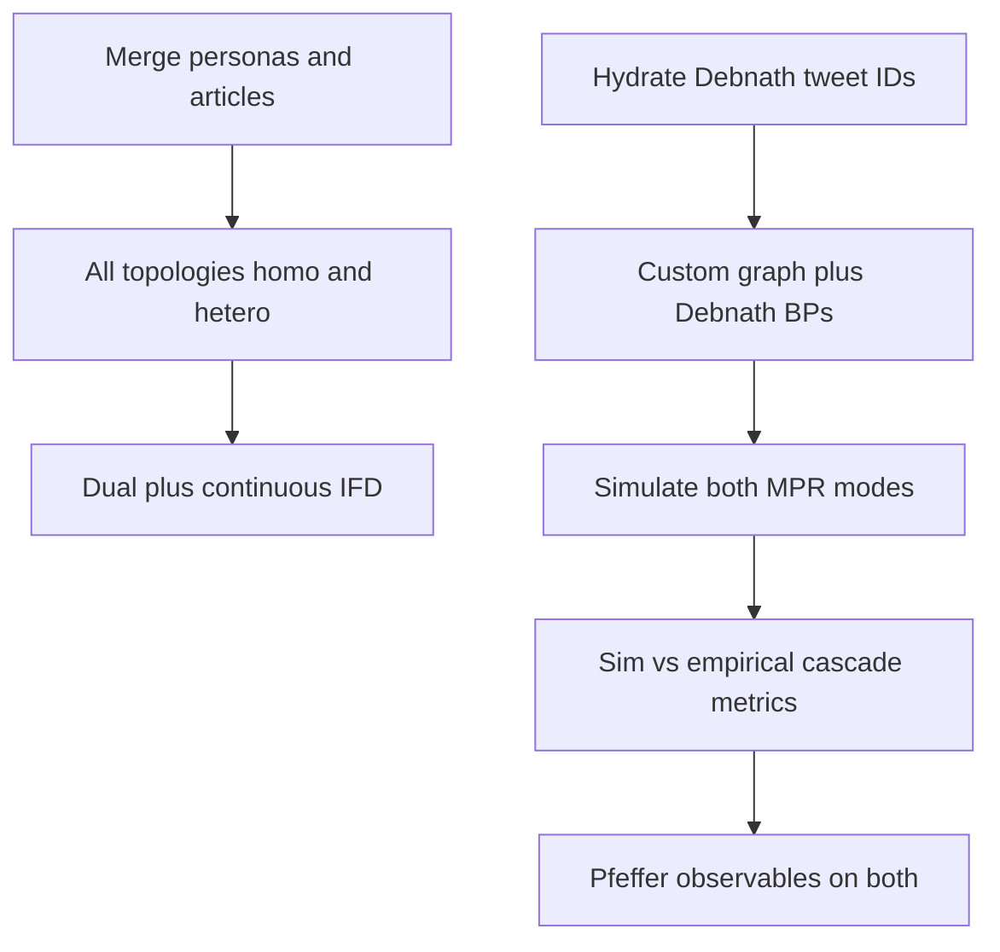

# Phase 2 plan — topologies × homo/hetero × dual/continuous, then Debnath network

**Date.** 18 September 2026.  
**Status.** Execution plan for an **isolated** campaign.  
**Do not touch** `thesisExperiment/runs/` or `thesisExperiment/results/tables/` (the discrete 12×12 chapter dataset).  
**New output:** `thesisExperiment/runs_phase2/` and `thesisExperiment/results_phase2/`.  
**Analysis and thesis prose are out of scope.**

## Isolation

| Path | Role |
|---|---|
| `thesisExperiment/runs/` | Phase 1 discrete 12×12 — **read-only** |
| `thesisExperiment/results/` | Phase 1 tables/figures — **read-only** |
| `thesisExperiment/configs/full/` | Phase 1 configs — **do not overwrite** |
| `thesisExperiment/configs/phase2/` | New T2c_ / T2d_ configs |
| `thesisExperiment/runs_phase2/` | New experiment dirs |
| `thesisExperiment/results_phase2/` | New CSVs, summary.md |
| `thesisExperiment/personas/merged.json` | Campaign 12 + extra Debnath candidates |
| `thesisExperiment/articles/merged.json` | Campaign 12 + extra discovery articles |

## Scoring (both MPR tables)

- **continuous** — headline MI/MPR is float ~0–5 (`miScoringMode: "continuous"`).
- **dual** — headline MI/MPR is **discrete** 0–5; continuous is `event.ifd.dual.continuous`. Two auditor LLM calls per event.
- Parser writes `*_discrete.csv` (from dual top-level), `*_continuous.csv` (from continuous-only runs **and** dual sidecars, labelled separately), `*_dual_gap.csv`.
- Do **not** mix discrete and continuous means. Do **not** rerun discrete-only (Phase 1 already is that).

## Grid (default)

Core articles (same six as Exp A): `scopex_2017`, `chemtrails_gates_2018_2021`, `sai_geoengineering`, `paris_agreement`, `climate_consensus`, `polar_bears`.

| Arm | Design | Configs × articles |
|---|---|---|
| T-H | 8 topologies × 12 homo personas × 2 modes | 192 configs × 6 articles ≈ 1152 cells |
| T-He | 8 topologies × 6 hetero mixes × 2 modes | 96 configs × 6 articles ≈ 576 cells |
| D-net | reconstructed/subsampled Debnath `custom` graph × homo + hetero × 2 modes × 2 seeds | small |

Eight topologies: `linear_chain`, `ring`, `random_er`, `small_world`, `scale_free`, `echo_chamber`, `polarized`, `hierarchical`.  
Nodes/hops/ticks = **8** (logged cost cut vs CIKM 30; not a Debnath hop protocol). `graphRandomSeed: 42`. N=1. Model `gpt-4o-mini`.

Prefixes: `T2c_` continuous, `T2d_` dual.

## Step-by-step

1. This file + `LOG.md` isolation note.
2. Merge libraries (dedupe ids; tag `source`).
3. Generate phase2 configs; never overwrite `configs/full`.
4. Probe one dual + one continuous cell (real API).
5. Run T-H then T-He; parse per topology; hatch 1-event dead cells.
6. Debnath reconstruct: Mendeley/OSF tweet IDs → hydrate if X API present; else hashtag co-occurrence fallback (not a retweet cascade).
7. Simulate custom graph with Debnath BPs, both MPR modes, homo + hetero.
8. Structural similarity (depth, size, breadth, virality) — Debnath has **no** empirical MPR.
9. Pfeffer observables on empirical vs sim (2014 has **seven** factors; cross-media held).
10. Stop at `results_phase2/summary.md`. No chapter prose.

## Honesty

- 8 hops is compression vs CIKM 30, not Debnath.
- Merged personas are theory-faithful reductions until hydrated HDBSCAN exists.
- Dual gap is not a third ground-truth MPR.
- If tweet hydration fails, comparison is structural/hashtag, not “simulated MPR = Twitter MPR.”
